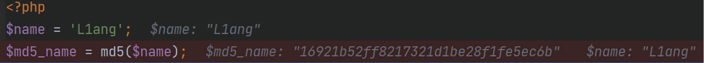
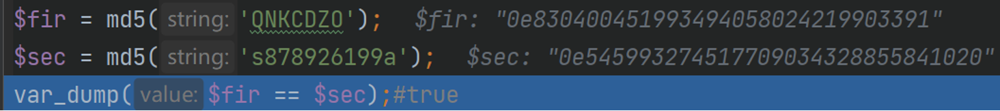

## php的基础语法

#### foreach

基础用法：

```php
foreach ($array as $value)
当前数组元素的值就会被赋值给 $value 变量
{
    要执行代码;
}
foreach ($array as $key => $value)
当前数组元素的键与值就都会被赋值给 $key 和 $value 变量
{
    要执行代码;
}
```

例子：

```php
<?php
// 示例1：仅获取值（适用于索引数组或关联数组）
$colors = ['red', 'green', 'blue'];
foreach ($colors as $value) {
    echo "颜色: $value\n";
}

// 示例2：同时获取键和值（常用于关联数组）
$person = [
    'name' => '张三',
    'age'  => 25,
    'city' => '北京'
];
foreach ($person as $key => $value) {
    echo "键: $key, 值: $value\n";
}
?>
```

输出结果：

```
颜色: red
颜色: green
颜色: blue
键: name, 值: 张三
键: age, 值: 25
键: city, 值: 北京
```

---

#### $\_GET 与 $\_POST

- GET：1.对任何人都是可见的2.发送信息的大小存在限制3.只能发送ASCII字符4.用于搜索排序和筛选
- POST：1.对其他人是不可见的2.发送信息的大小不限3.能发送的字符不限4.用于修改和写入数据


---

#### 弱类型比较

松散比较：“==“只比较数值不比较

类型严格比较：“===”比较数值的同时也比较类型

例如：

```
$id = $_GET['id']; // 传入 id=1abc

if ($id == 1) {
    echo "进入成功";
}
```

在 **PHP 7** 中，`"1abc" == 1` 为 `true`（字符串被转成数字 1）。
在 **PHP 8** 中，这个比较为 `false`，所以此绕过在 PHP 8 已失效。


---

#### md5碰撞

Md5:信息摘要算法，将任意长度通过计算得到32位16进制数字的序列。




php中的md5碰撞

1. 0^n



由于这里使用的是 == 松散比较，值比较数值

这里的$fir 和 $sec的值都是0exxxx和0eyyyy，属于科学计数法，数值都是为**0 × 10^N**，所以数值都是为0（浮点数）

2. 数组

```php
$a=[1,2];
$b=[3,4];
$f_1=md5($a);
$f_2=md5($b);
var_dump($f_1 == $f_2); #true 
```

---

#### var_dump

是 PHP 中的一个**调试函数**，用来输出变量的**类型**和**值**，通常用于开发时查看变量到底是什么。

例如：
```php
$num = 123;
$str = "hello";
$arr = [1, 2, 3];
$bool = true;
$nothing = null;

var_dump($num);
var_dump($str);
var_dump($arr);
var_dump($bool);
var_dump($nothing);
```

结果：
```php
int(123)
string(5) "hello"
array(3) {
  [0]=> int(1)
  [1]=> int(2)
  [2]=> int(3)
}
bool(true)
NULL
```


---

## 常见函数的绕过手法

#### intval(num,[base=10])

用于**获取变量的整数值**，转换为十进制。成功时返回 var 的 integer 值，失败时返回 0。

如果 base 是 0，通过检测 var 的格式来决定使用的进制：

- 如果字符串包括了 "0x" (或 "0X") 的前缀，使用 16 进制 (hex)；否则，
- 如果字符串以 "0" 开始，使用 8 进制 (octal)；否则，
- 将使用 10 进制 (decimal)。

例如：

```php
$id = $_GET['id']; // 传入 id=1abc

if (intval($id) == 1) {
    echo "进入成功";
} else {
    echo "失败";
}
```

结果：传入 `?id=1abc`，`intval("1abc")` 返回 `1`，所以输出“进入成功”。


#### is_numeric()

用于检测变量**是否为数字或数字字符串**，如果是数字和数字字符串则返回TRUE，否则返回FALSE。

绕过手段：

（1）数字+字符绕过

（2）空格**%20**，空字符%00绕过


#### preg_match()

将输入的字符串与要搜索的模式进行匹配。匹配成功返回1，失败返回0。

绕过方法：

（1）数组绕过

（2）换行符%0a绕过


#### strcmp()

比较两个字符串（区分大小写）如果str1<str2 ，则返回<0 ，如果str1大于str2 ，返回>0 ，如果两者相等 ，返回0

绕过方式：数组绕过


#### strpos()

查找字符串在另一字符串中第一次出现的位置，失败时返回False。

绕过方式：数组绕过

---

## 变量覆盖


**什么是变量覆盖：**

> 变量覆盖指的是可以用我们的传参值代替程序原有的变量值

哪里存在变量覆盖：

> 经常导致变量覆盖漏洞场景有：**$$**，**extract()**函数，**parse_str()**函数等


#### $$

表示的是一个可变变量获取了一个普通变量的值作为这个可变变量的变量名

例子：

```php
<?php

$a = 'hello';      // 把字符串 'hello' 赋给变量 $a
$$a = 'world';     // 可变变量：先取 $a 的值 'hello'，把它当作变量名，所以相当于 $hello = 'world';
echo $a;           // 输出 $a 的值，即 'hello'
echo $$a;          // 输出 $$a 的值。因为 $a 是 'hello'，所以 $$a 就是 $hello，其值为 'world'
```

输出结果：

```
helloworld
```


#### **`extract()`**


**把数组的键名当作变量名，键值当作变量值**，在当前作用域中创建变量

例子：

```php
$arr = ['name' => '张三', 'age' => 25];
extract($arr);
echo $name; // 张三
echo $age;  // 25
```


##### **为什么会有漏洞？**

因为 `extract()` 默认使用 `EXTR_OVERWRITE` 模式，**如果变量已经存在，就会被数组中的同名键覆盖**。

如果这个数组来自用户输入（如 `$_GET`、`$_POST`、`$_REQUEST`），攻击者就能覆盖程序中的关键变量。


例如：

```php
<?php
$is_admin = false;

extract($_GET);   // 危险！

if ($is_admin) {
    echo "欢迎管理员！flag{...}";
} else {
    echo "普通用户";
}
?>
```

访问：

```
?is_admin=1
```

`extract($_GET)` 会把 `$is_admin` 覆盖为 `"1"`，于是进入管理员分支。


例如：

```php
<?php
$file = 'index.php';
extract($_GET);
include($file);
?>
```

访问：

```url
?file=../../etc/passwd
```

`$file` 被覆盖，导致**任意文件包含**。


#### `parse_str()`


用于**将查询字符串解析为变量**。

语法：
```php
parse_str(string $string,array $result):void
```

- 第一个参数：要解析的字符串，通常是 URL 查询字符串。
- 第二个参数：**（PHP 8.0 起必需）** 一个数组，解析结果会存入这个数组，而不会创建变量。


漏洞出现形式：

```php
parse_str($_SERVER['QUERY_STRING']);
parse_str($_GET['data']);
```

> 没有传入第二个参数，那么解析出的键值对就会**直接变成当前作用域的变量**。
> 如果这些变量名与程序中已有的变量重名，就会**覆盖**它们。


例子：

```php
<?php
$is_admin = false;

parse_str($_SERVER['QUERY_STRING']); // 危险！

if ($is_admin) {
    echo "欢迎管理员！flag{...}";
} else {
    echo "普通用户";
}
?>
```

访问：

```
?is_admin=1
```


例子：

```php
<?php
$file = 'index.php';
parse_str($_SERVER['QUERY_STRING']);
include($file);
?>
```

访问：

```
?file=../../etc/passwd
```