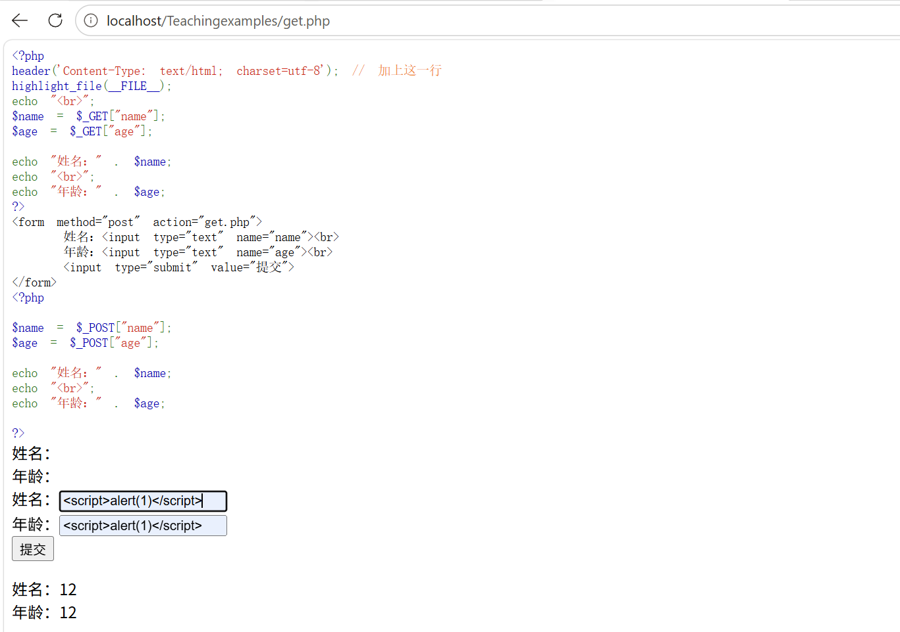
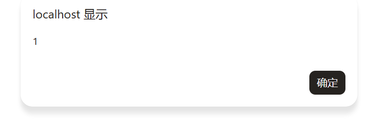

## get.php文件

#### **文件代码：**

```php
<?php
header('Content-Type: text/html; charset=utf-8'); // 加上这一行
highlight_file(__FILE__);
echo "<br>";
$name = $_GET["name"];
$age = $_GET["age"];

echo "姓名：" . $name;
echo "<br>";
echo "年龄：" . $age;
?>
<form method="post" action="get.php">
    姓名：<input type="text" name="name"><br>
    年龄：<input type="text" name="age"><br>
    <input type="submit" value="提交">
</form>
<?php

$name = $_POST["name"];
$age = $_POST["age"];

echo "姓名：" . $name;
echo "<br>";
echo "年龄：" . $age;

?>
```

这是一段很典型的存储性XSS和反射型XSS

**存储：**

http://localhost/Teachingexamples/get.php?name=<script>alert(1)</script>&age=1

**反射型：**



点击提交之后就会显示



#### **解释：**

如果不加下面这一行

```php
header('Content-Type: text/html; charset=utf-8'); // 加上这一行
```

显示的就是乱码


#### **tips：**

> ?name=<script>alert(1)</script>&age=1

这样是传一个字符串，但是如果别人代码写的烂，没做检查的话（这个在other.php中有）还可以传一个数组

> ?name=<script>alert(1)</script>&age[]=1

## md5_0e.php文件

#### **文件代码：**

```php
<?php

$fir = md5("QNKCDZO");
$sec = md5("s878926199a");

echo($fir); 
echo "<br>";
echo($sec);
echo "<br>";

if ($fir == $sec) {
    echo "弱相等情况下相等";
}
else{
    echo "弱相等情况下不相等";
    }
echo "<br>";
if ($fir === $sec) {
    echo "强相等情况下相等";
}
else{
    echo "强相等情况下不相等";
    }
echo "<br>";
highlight_file(__FILE__);
?>
```

## weak_type_comparison.php

#### **文件代码：**

```php
<?php

$a = 1;
$b = "1";
if ($a == $b) {
    echo "相等";
} else {
    echo "不相等";
}

echo "<br>";

$c = 1;
$d = "1";

if ($a === $b) {
    echo "相等";
} else {
    echo "不相等";
}
echo "<br>";
highlight_file(__FILE__);
?>
```

## other.php

#### **文件代码：**

```php
<?php
header("Content-Type:text/html; charset=utf-8");

/**
 * 小工具：输出标题/分隔线
 */
function title($t) {
    echo "<h2 style='margin:18px 0 6px;'>$t</h2>";
}
function hrline() {
    echo "<hr style='margin:10px 0;'>";
}
function show($label, $value) {
    echo "<b>$label</b>：";
    var_dump($value);
    echo "<br>";
}

echo "<h1>1.7 PHP常见函数及常见坑点演示</h1>";

/* =========================================================
 * 1) preg_match()
 * ========================================================= */
title("① preg_match()：正则匹配（成功返回 1，失败返回 0）");

$pattern = '/^admin$/';   // 只允许完全等于 admin
$input1  = "admin";
$input2  = "admin123";
$input3  = "admin\n";     // 末尾有换行（\n）

show("preg_match(admin)", preg_match($pattern, $input1));
show("preg_match(admin123)", preg_match($pattern, $input2));

echo "<br><b>⚠️ 末尾换行的坑：</b><br>";
echo "input3 实际内容是：";
var_dump($input3);
echo "<br>";
show("preg_match(\"admin\\n\")", preg_match($pattern, $input3));

echo "<br><b>✅ 更稳的写法（不吃换行）：</b><br>";
$pattern_safe = '/\Aadmin\z/'; // \A \z 更严格：必须整串完全匹配
show("preg_match(\\Aadmin\\z, \"admin\\n\")", preg_match($pattern_safe, $input3));

echo "<br><b>✅ 或者先清理输入：</b><br>";
$input3_trim = trim($input3);
show("trim 后再匹配", preg_match($pattern, $input3_trim));

echo "<br><b>⚠️ 数组输入的坑：</b><br>";
$bad = array("admin");
try {
    // PHP 8+ 这里通常会抛 TypeError
    $r = preg_match($pattern, $bad);
    show("preg_match(数组)", $r);
} catch (Throwable $e) {
    echo "preg_match(数组) 报错：".$e->getMessage()."<br>";
    echo "✅ 解决：先判断 is_string() 再做 preg_match<br>";
}

hrline();

/* =========================================================
 * 2) intval()
 * ========================================================= */
title("② intval(num, base=10)：取整数（base=0 会自动识别进制）");

$s1 = "123abc";
$s2 = "010";
$s3 = "0x10";
$s4 = "10";

show("intval('123abc')", intval($s1));
echo "<small>解释：遇到非数字就停止，所以 '123abc' 变成 123</small><br><br>";

echo "<b>base = 0 自动识别：</b><br>";
show("intval('010', 0)", intval($s2, 0));   // 八进制 -> 8
show("intval('0x10', 0)", intval($s3, 0));  // 十六进制 -> 16
show("intval('10', 0)", intval($s4, 0));    // 十进制 -> 10

echo "<br><b>✅ 如果你只想允许“纯数字”，别只靠 intval：</b><br>";
$only = "123";
$mix  = "123abc";
show("ctype_digit('123')", ctype_digit($only));
show("ctype_digit('123abc')", ctype_digit($mix));
echo "<small>解释：ctype_digit 只允许纯数字字符串（更适合做输入校验）</small><br>";

hrline();

/* =========================================================
 * 3) strcmp()
 * ========================================================= */
title("③ strcmp(str1, str2)：比较字符串（相等返回 0）");

$real = "pass123";
$in1  = "pass123";
$in2  = "pass124";

show("strcmp(pass123, pass123)", strcmp($real, $in1));
show("strcmp(pass123, pass124)", strcmp($real, $in2));

echo "<br><b>⚠️ 常见坑：把 strcmp 的结果用 == 来判断，遇到异常类型可能出问题</b><br>";
$in_bad = array("pass123"); // 模拟异常输入（数组）

try {
    $cmp = strcmp($real, $in_bad); // PHP 8+ 通常直接 TypeError
    show("strcmp(数组)", $cmp);

    // 错误示例（不推荐）
    if ($cmp == 0) {
        echo "（错误示例）== 0 判断：通过<br>";
    } else {
        echo "（错误示例）== 0 判断：不通过<br>";
    }

} catch (Throwable $e) {
    echo "strcmp(数组) 报错：".$e->getMessage()."<br>";
    echo "✅ 正确做法：先 is_string()，并且用 === 0 判断<br>";
}

echo "<br><b>✅ 推荐写法：</b><br>";
$input_ok = "pass123";
if (is_string($input_ok) && strcmp($real, $input_ok) === 0) {
    echo "严格判断：密码正确<br>";
} else {
    echo "严格判断：密码错误<br>";
}

hrline();

/* =========================================================
 * 4) strpos()
 * ========================================================= */
title("④ strpos(haystack, needle)：找子串第一次出现位置（找不到返回 false）");

$text = "admin_user";
show("strpos('admin_user', 'admin')", strpos($text, "admin")); // 0
show("strpos('admin_user', 'user')",  strpos($text, "user"));  // 6
show("strpos('admin_user', 'root')",  strpos($text, "root"));  // false

echo "<br><b>⚠️ 超经典坑：不要这样写：</b><br>";
echo "<code>if (strpos(\$text,'admin')) { ... }</code><br>";
echo "因为 'admin' 在开头位置是 0，0 会被当成 false！<br><br>";

echo "<b>✅ 正确写法：</b><br>";
if (strpos($text, "admin") !== false) {
    echo "admin 存在（用 !== false 判断）<br>";
} else {
    echo "admin 不存在<br>";
}

echo "<br><b>⚠️ 数组输入的坑：</b><br>";
$needle_bad = array("admin");
try {
    $pos = strpos($text, $needle_bad);
    show("strpos(needle=数组)", $pos);
} catch (Throwable $e) {
    echo "strpos(数组) 报错：".$e->getMessage()."<br>";
    echo "✅ 解决：先判断 is_string() 再 strpos<br>";
}

hrline();

echo "<h3>源码展示（方便你课堂演示）</h3>";
highlight_file(__FILE__);
?>
```

不懂的地方可以看ai的回复：

https://chat.deepseek.com/share/viqqnm7iba3idb8xrk


#### 注意的小点：

```php
var_dump(0 == false);   // bool(true)
var_dump(0 === false);  // bool(false)
var_dump(0 != false);   // bool(false)
var_dump(0 !== false);  // bool(true)
```

